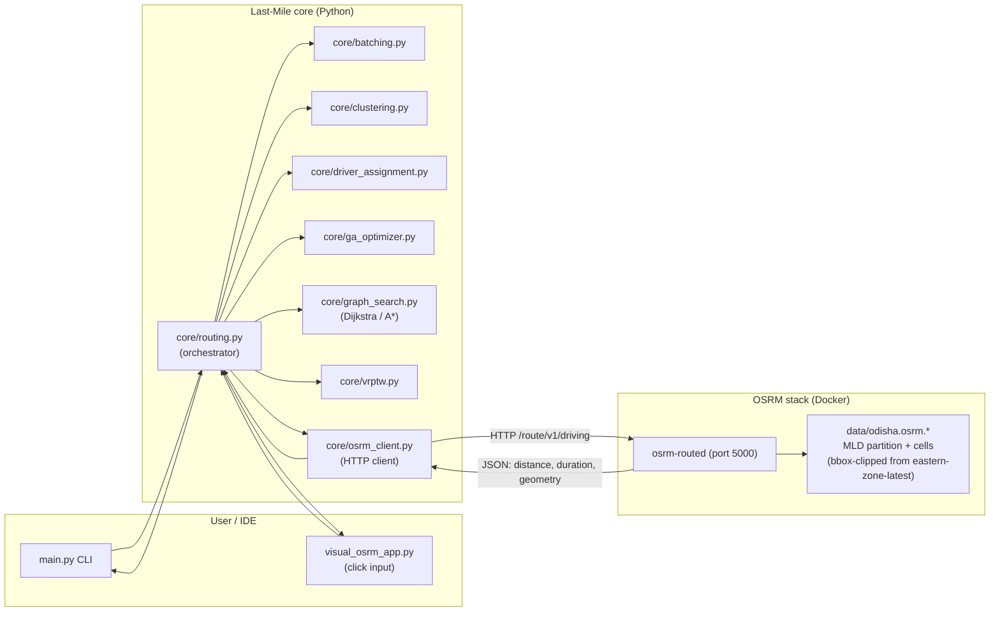
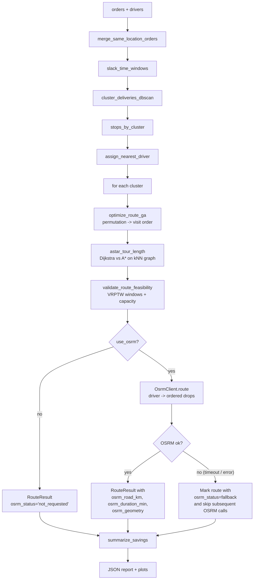
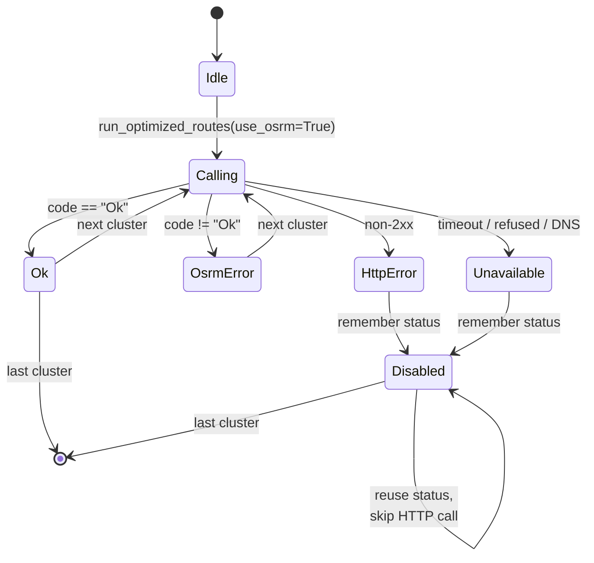
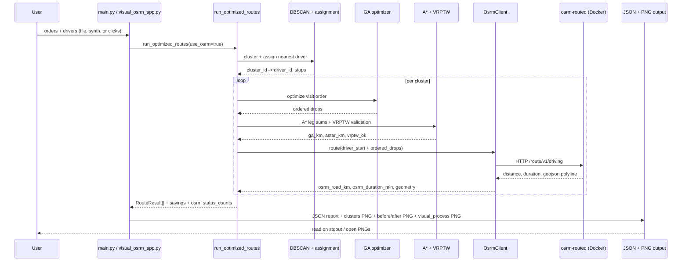

# Last-Mile

**Last-Mile** is a Python research/demo pipeline for **last-mile delivery optimization**. It stitches together **spatial batching and clustering**, **nearest-driver assignment**, a **genetic algorithm (GA)** for stop order inside each cluster, **graph shortest paths** (Dijkstra vs A\*), **VRPTW feasibility checks**, and **matplotlib** visualizations plus a structured **JSON** report.

It now also integrates with a **local OSRM** (Open Source Routing Machine) server so the GA-chosen visit order can be evaluated as a real **road route** rather than a great-circle approximation, and it ships a **graphical click-based input → process → output app** so you can build inputs visually, watch the pipeline run, and see the optimized routes drawn on the map.

The default entry point runs everything on **synthetic** orders and drivers centered on an **Odisha / Bhubaneswar-like region** (~20.30°N, 85.82°E). The OSRM stack is built from a **bbox-clipped Odisha PBF** (carved out of Geofabrik's `eastern-zone-latest` extract via `osmium-tool`) so the road network covers the same area as the synthetic data with a tiny ~37 MB PBF and a sub-minute MLD build, even on Apple Silicon.

---

## Table of contents

1. [What the pipeline does](#what-the-pipeline-does)
2. [System architecture (with diagrams)](#system-architecture-with-diagrams)
3. [OSRM integration](#osrm-integration)
4. [OSRM Optional Mode](#osrm-optional-mode)
5. [Graphical input → process → output app](#graphical-input--process--output-app)
6. [Repository layout](#repository-layout)
7. [Requirements and installation](#requirements-and-installation)
8. [How to run](#how-to-run)
9. [Input data shape (orders and drivers)](#input-data-shape-orders-and-drivers)
10. [End-to-end process (stage by stage)](#end-to-end-process-stage-by-stage)
11. [How Last-Mile and OSRM work together](#how-Last-Mile-and-osrm-work-together)
12. [Libraries: what each is for and where it appears](#libraries-what-each-is-for-and-where-it-appears)
13. [Outputs](#outputs)
14. [Default synthetic parameters](#default-synthetic-parameters-mainpy)
15. [Future upgrades](#future-upgrades)
16. [License / attribution](#license--attribution)

---

## What the pipeline does

At a high level:

1. **Merge** orders that share the same drop coordinate (within rounded lat/lon).
2. Optionally **slack** time windows to ease feasibility after merges.
3. **Cluster** merged stops with **DBSCAN** in geographic space (Haversine metric).
4. **Assign** each cluster to the **nearest** driver by Haversine centroid-to-driver distance.
5. For each cluster, **optimize visit order** with a **GA** (permutation-encoded open tour from the assigned driver).
6. **Evaluate** chained route length on a **k-NN geographic graph** using **A\*** per leg (and benchmark **Dijkstra** vs A\* distances).
7. **Optionally evaluate the same ordered route on the real road network via OSRM** to obtain road km, driving duration, and a polyline geometry to plot.
8. **Validate** the proposed sequence with a lightweight **VRPTW** simulator (capacity, windows, duration).
9. Emit **comparison metrics** versus a naive baseline (each stop served independently by its closest driver).
10. **Plot** clusters/routes and naive vs optimized geometry; optional **slideshow** presenter or **graphical click-input app**.

Greedy dynamic batching is also computed (from raw orders) to illustrate streaming-style wave partitioning; the main routing pipeline in `run_optimized_routes` calls it mainly for methodological alignment (see `core/routing.py`).

---

## System architecture (with diagrams)

### High-level component diagram



### Data flow inside `run_optimized_routes` (with OSRM)



---

## OSRM integration

OSRM (Open Source Routing Machine) is plugged in as an **optional, drop-in road-network evaluator**. The GA still chooses the visit **order** inside each cluster, A\* still benchmarks the chained Haversine-on-graph distance, and the VRPTW simulator still validates feasibility — but with `--use-osrm`, the very same ordered visit sequence is **also routed on the real road graph** through the OSRM HTTP API. Last-Mile never falls over if OSRM is missing: the OSRM client returns a structured status, the pipeline logs that status per route, and the existing GA/A\* metrics remain authoritative.

### What the local OSRM stack provides

The `OSRM/` folder contains a turnkey Docker setup:

| File | Role |
|------|------|
| `OSRM/docker-compose.yml` | Runs `osrm/osrm-backend:latest` (pinned `platform: linux/amd64`) with `osrm-routed --algorithm mld` on container port `5000`, bound to `./data/odisha.osrm` by default. Override `OSRM_MAP_STEM` (e.g. `eastern-zone-latest`, `india-latest`) to point at any other built dataset. Healthchecked via `/health`. |
| `OSRM/scripts/download_map.sh` | Idempotently downloads the source OSM extract from Geofabrik. When `OSRM_MAP_STEM=odisha` (the default) it fetches `eastern-zone-latest.osm.pbf` because Geofabrik does not publish a standalone Odisha extract. |
| `OSRM/scripts/clip_to_bbox.sh` | Uses `osmium-tool` (native if installed, else the `iboates/osmium` Docker image) to clip a source PBF to a bounding box. Defaults clip `eastern-zone-latest.osm.pbf` → `odisha.osm.pbf` (~37 MB). Override `OSRM_BBOX`, `OSRM_SOURCE_STEM`, `OSRM_MAP_STEM` for other regions. |
| `OSRM/scripts/build_osrm.sh` | Runs the **MLD pipeline** (`osrm-extract` → `osrm-partition` → `osrm-customize`) for `${OSRM_MAP_STEM:-odisha}`. If the chosen PBF is missing but a source PBF (`OSRM_SOURCE_STEM`) exists, it transparently invokes `clip_to_bbox.sh` first. |
| `OSRM/scripts/run_server.sh` | Starts the container via `docker-compose up -d`, then polls `http://localhost:5000/health` until ready. |
| `OSRM/scripts/stop_server.sh` | Brings the container down. |
| `OSRM/tests/test_osrm_api.py` | Smoke tests the `/health`, `/route/v1`, `/table/v1`, `/nearest/v1` endpoints with Odisha (Bhubaneswar-area) sample coordinates. |

### One-time bring-up

```bash
cd OSRM
./scripts/download_map.sh         # fetches eastern-zone-latest.osm.pbf (~242 MB)
./scripts/clip_to_bbox.sh         # carves out odisha.osm.pbf (~37 MB) — needs osmium-tool (brew install osmium-tool) or Docker
./scripts/build_osrm.sh           # extract + partition + customize on odisha.osm.pbf
./scripts/run_server.sh           # boots osrm-routed on http://localhost:${OSRM_HOST_PORT:-5001}
python tests/test_osrm_api.py     # optional smoke test
```

`build_osrm.sh` will transparently call `clip_to_bbox.sh` if `data/odisha.osm.pbf` is missing but `data/eastern-zone-latest.osm.pbf` exists, so the explicit clip step is optional.

The default flow downloads `eastern-zone-latest.osm.pbf` (~242 MB), clips it to an Odisha bounding box producing `odisha.osm.pbf` (~37 MB), then runs `osrm-extract`/`osrm-partition`/`osrm-customize` on the clipped file. End-to-end this finishes in **~1 minute** on Apple Silicon (vs an OOM crash on the full eastern-zone under x86 emulation). Once `osrm-routed` is healthy (Docker maps container port `5000` to host `${OSRM_HOST_PORT:-5001}`), Last-Mile will use it whenever you pass `--use-osrm` and point `--osrm-url` at that host port.

To target a different region, set both env vars together, for example:

```bash
OSRM_MAP_STEM=goa OSRM_SOURCE_STEM=western-zone-latest \
OSRM_BBOX=73.65,14.85,74.35,15.85 ./scripts/build_osrm.sh
```

### Last-Mile's OSRM HTTP client — `core/osrm_client.py`

Last-Mile speaks to OSRM through a tiny, dependency-free client built on `urllib`:

| Symbol | Purpose |
|--------|---------|
| `OsrmClient(base_url, timeout_seconds)` | Holds the OSRM base URL (default `http://localhost:5000`) and a per-request timeout (default `4.0` s). |
| `OsrmClient.route(points)` | Calls `GET /route/v1/driving/{coords}?overview=full&geometries=geojson&steps=false&alternatives=false` over the supplied **lat,lon** waypoints, in order. |
| `OsrmRoute` (dataclass) | Frozen result with `road_km`, `duration_min`, `geometry` (lat,lon polyline), `status`, optional `code`, `message`, and an `ok` property. |

A few important details:

- **Coordinate ordering**: Last-Mile stores `(lat, lon)` everywhere; OSRM's REST API expects `lon,lat`. The client is the only place that conversion lives, so the rest of the codebase stays consistent.
- **Geometry round-trip**: when OSRM returns a `geojson` polyline, the client flips each `[lon, lat]` back into `(lat, lon)` so `visual_presenter.py`, `visual_osrm_app.py`, and `utils.plot_before_after` can plot it directly with their existing `(lat, lon)` conventions.
- **Status surface**: instead of raising on every network/transport error, the client returns one of four statuses on `OsrmRoute.status`:
  - `ok` — happy path; `road_km`, `duration_min`, and `geometry` are populated.
  - `osrm_error` — server returned `code != "Ok"` (e.g. `NoRoute`, `InvalidQuery`).
  - `http_error` — non-2xx HTTP response.
  - `unavailable` — DNS failure, refused connection, timeout, or malformed JSON. This is the case when OSRM simply isn't running.

### How `core/routing.py` consumes OSRM

`run_optimized_routes(..., use_osrm=False, osrm_base_url="http://localhost:5000")` was extended to:

1. Lazily construct a single `OsrmClient` when `use_osrm=True`.
2. After GA + A\* + VRPTW finish for a cluster, call `OsrmClient.route([driver_start] + ordered_drops)`.
3. Store the response on `RouteResult` as four new fields:
   - `osrm_road_km: float | None`
   - `osrm_duration_min: float | None`
   - `osrm_geometry: list[(lat, lon)] | None`
   - `osrm_status: str` (default `"not_requested"`)
4. **Short-circuit on transport failure**: if a call ever returns `unavailable` or `http_error`, the orchestrator records that status, **stops issuing more OSRM requests for this run**, and tags every remaining cluster with the same fallback status. This avoids 4 s × N timeouts when the server is offline.
5. Aggregate per-status counts into the pipeline summary:

```jsonc
"pipeline": {
  "merged_stop_count": 24,
  "clusters": 7,
  "merge_map": { ... },
  "osrm": {
    "requested": true,
    "base_url": "http://localhost:5000",
    "connected": true,                 // result of the preflight probe
    "mode": "core_plus_osrm",         // "core_only" | "core_plus_osrm"
    "reason": "connected",            // "not_requested" | "connected" | "unavailable" | "http_error" | "osrm_error"
    "status_counts": { "ok": 7 },     // per-route status histogram
    "enriched_routes": 7,             // # routes that received OSRM road km/duration
    "total_routes": 7
  }
}
```

### `summarize_savings` adds an OSRM track

When all clusters have a numeric `osrm_road_km`, `summarize_savings` adds two more numbers alongside the existing GA and A\* totals:

| Key | Meaning |
|-----|---------|
| `optimized_osrm_road_km` | Sum of road-network km across all optimized routes. |
| `saved_km_vs_naive_osrm` | `max(0, naive_sum_legs_km - optimized_osrm_road_km)`. |

If any route's OSRM call failed, `optimized_osrm_road_km` reports `0.0` so the totals stay honest about the partial result.

### OSRM client state machine



### Sequence diagram: a single OSRM-evaluated cluster

```mermaid
sequenceDiagram
    autonumber
    participant CLI as main.py / visual_osrm_app.py
    participant ROUT as run_optimized_routes
    participant GA as optimize_route_ga
    participant AST as astar_tour_length
    participant VRP as validate_route_feasibility
    participant OC as OsrmClient
    participant SRV as osrm-routed (Docker)

    CLI->>ROUT: orders, drivers, use_osrm=True
    ROUT->>GA: cluster coords + driver start
    GA-->>ROUT: ordered visit permutation
    ROUT->>AST: chained legs on kNN graph
    AST-->>ROUT: ga_km, astar_km, leg diagnostics
    ROUT->>VRP: ordered drops + windows + capacity
    VRP-->>ROUT: vrptw_ok, detail
    ROUT->>OC: route([driver_start, drop1, ..., dropN])
    OC->>SRV: GET /route/v1/driving/lon,lat;...
    SRV-->>OC: { code:"Ok", routes:[{distance, duration, geometry}] }
    OC-->>ROUT: OsrmRoute(road_km, duration_min, geometry, "ok")
    ROUT-->>CLI: RouteResult with all metrics + JSON summary
```

---

## OSRM Optional Mode

OSRM is wired in as a **best-use enhancement layer**, never a hard dependency. Everything in `core/` — DBSCAN, nearest-driver assignment, GA sequencing, A\*/Dijkstra graph search, VRPTW feasibility — runs identically whether OSRM is installed, running, partially failing, or completely down.

### What this mode does

- **Preflights OSRM once per run.** Before the route loop, `run_optimized_routes` issues a fast `nearest/v1/driving` probe with a tight timeout. The result is cached on the pipeline summary (`pipeline.osrm.connected` + `pipeline.osrm.reason`).
- **Enriches per route when reachable.** When the probe succeeds, the GA-chosen visit order for each cluster is also routed via OSRM to add `osrm_road_km`, `osrm_duration_min`, and a polyline `osrm_geometry` to the `RouteResult`.
- **Surfaces an "effective metric" on every route.** Each `RouteResult` exposes four additive fields that pick the best-available source for downstream reports/plots:
  - `effective_distance_km` — picked from OSRM → A\* → GA in that order.
  - `effective_duration_min` — OSRM duration when present; otherwise distance ÷ 25 km/h proxy.
  - `effective_distance_source` — `osrm` | `astar` | `ga_proxy`.
  - `effective_time_source` — `osrm` | `proxy`.
- **Reports coverage.** `pipeline.osrm.enriched_routes / total_routes` tells you how many routes got real road metrics, even on partial-failure runs.
- **Prints status to the console.** See [example logs](#example-logs) below.

### What this mode does NOT do

- It does **not** change the GA, A\*, Dijkstra, VRPTW, or DBSCAN behavior. The visit order, driver assignment, and feasibility checks are identical with OSRM on or off.
- It does **not** modify any existing JSON keys. Every new field (`pipeline.osrm.connected`, `pipeline.osrm.mode`, `pipeline.osrm.reason`, `pipeline.osrm.enriched_routes`, `pipeline.osrm.total_routes`, the four `effective_*` fields per route) is **additive**.
- It does **not** retry or wait for OSRM. Preflight is a single short call; if it fails, the run uses core routing immediately.
- It does **not** silently swallow OSRM problems. The reason is always recorded on `pipeline.osrm.reason` and `route.osrm_status`, and printed to stdout.

### Fallback behavior

| Situation | Behavior |
|-----------|---------|
| `--use-osrm` not passed | `mode=core_only`, `reason=not_requested`. Every route reports `osrm_status="not_requested"`. |
| Server unreachable at startup (DNS/refused/timeout) | Preflight returns `unavailable`. **No** `/route/v1/driving` calls are issued at all (no per-route timeout penalty). `mode=core_only`, `reason=unavailable`. |
| Server returns HTTP 5xx at startup | Preflight returns `http_error`. Same fallback as above with `reason=http_error`. |
| Server is up but rejects a specific route (`code != "Ok"`, e.g. `NoRoute`) | That route gets `osrm_status="osrm_error: ..."`; the orchestrator **does not** disable OSRM for the rest of the run. |
| Server crashes mid-run | First transport-level failure (`unavailable` / `http_error`) trips a one-way circuit breaker. Remaining routes inherit the same status without a network call. `mode` remains `core_plus_osrm` if at least one route was enriched, otherwise drops to `core_only`. |

In all cases the route count is unchanged, every route gets effective distance/time numbers, and `pipeline.osrm` carries enough information to explain *why* OSRM did or did not contribute.

### Example logs

**`--use-osrm` off (default):**

```text
$ python main.py
OSRM: not requested (pass --use-osrm to enable road enrichment)
{ ...JSON report... }
Figures written: .../output_clusters_routes.png .../output_before_after.png
```

`pipeline.osrm` block in the JSON:

```jsonc
"osrm": {
  "requested": false,
  "base_url": null,
  "connected": false,
  "mode": "core_only",
  "reason": "not_requested",
  "status_counts": { "not_requested": 7 },
  "enriched_routes": 0,
  "total_routes": 7
}
```

**`--use-osrm` on, server **connected**:**

```text
$ python main.py --use-osrm --osrm-url http://localhost:5000
OSRM: requested at http://localhost:5000 (preflight pending...)
OSRM: connected (mode=core_plus_osrm)
{ ...JSON report... }
Figures written: .../output_clusters_routes.png .../output_before_after.png
OSRM enriched routes: 7/7
```

`pipeline.osrm` block in the JSON:

```jsonc
"osrm": {
  "requested": true,
  "base_url": "http://localhost:5000",
  "connected": true,
  "mode": "core_plus_osrm",
  "reason": "connected",
  "status_counts": { "ok": 7 },
  "enriched_routes": 7,
  "total_routes": 7
}
```

**`--use-osrm` on, server **not connected**:**

```text
$ python main.py --use-osrm --osrm-url http://localhost:5000
OSRM: requested at http://localhost:5000 (preflight pending...)
OSRM: not connected (unavailable), using core routing
{ ...JSON report... }
Figures written: .../output_clusters_routes.png .../output_before_after.png
OSRM enriched routes: 0/7
```

`pipeline.osrm` block in the JSON:

```jsonc
"osrm": {
  "requested": true,
  "base_url": "http://localhost:5000",
  "connected": false,
  "mode": "core_only",
  "reason": "unavailable",
  "status_counts": { "unavailable: <urlopen error ...>": 7 },
  "enriched_routes": 0,
  "total_routes": 7
}
```

**Mid-run failure (partial enrichment):** `pipeline.osrm.mode` stays `core_plus_osrm`, `pipeline.osrm.enriched_routes` < `total_routes`, and `status_counts` carries both `"ok"` and the failure reason key.

### Visual surfacing

- The `--present` slideshow's slide 6 ("Navigation · OSRM/A\* · VRPTW") prints `OSRM road geometry: connected (X/Y)` or `OSRM road geometry: not connected (reason)`. Slide 8's subtitle echoes the same.
- The click-based `--visual-input` app shows a single-line OSRM status (`OSRM: connected (X/Y enriched)` / `OSRM: partial enrichment X/Y` / `OSRM: not connected (reason)`) both in its right-side info panel and as the figure subtitle of `output_osrm_visual_process.png`. Route polylines fall back to the straight-line `driver → ordered drops` chain whenever OSRM geometry is missing or a degenerate near-zero-length artifact.

### Tests covering the optional behavior

`tests/test_osrm_optional_behavior.py` runs offline (it stubs `OsrmClient.health_check` / `OsrmClient.route`) and exercises:

- core-only with `--use-osrm` off,
- full enrichment with `--use-osrm` on + healthy server,
- immediate fallback with `--use-osrm` on + server down at start,
- partial enrichment + circuit-breaker trip with `--use-osrm` on + mid-run failure,
- the visual status label and the safe polyline selector.

Run them with:

```bash
pytest tests/test_osrm_optional_behavior.py -v
```

---

## Graphical input → process → output app

`visual_osrm_app.py` opens a Matplotlib window where you build the routing problem **by clicking** and watch the same `run_optimized_routes` pipeline render its results back graphically.

```mermaid
flowchart LR
    subgraph Stage1[1. Graphical input]
        L1[Click Order mode]
        L2[Click Driver mode]
        L3[Click Load sample]
        L4[Click Reset]
    end
    subgraph Stage2[2. Click Run pipeline]
        P1[merge_same_location_orders]
        P2[cluster_deliveries_dbscan]
        P3[stops_by_cluster + assign_nearest_driver]
        P4[run_optimized_routes use_osrm=True]
    end
    subgraph Stage3[3. Visual output panel]
        O1[Input: orders + drivers]
        O2[Process: clusters + assignment dashed lines]
        O3[Output: optimized polylines<br/>OSRM road geometry when available]
        O4[Footer: GA km, A* km, OSRM km, status counts]
        O5[PNG saved: output_osrm_visual_process.png]
    end

    Stage1 --> Stage2 --> Stage3
```



Run it:

```bash
python main.py --visual-input --osrm-url http://localhost:5000
```

Buttons (rendered along the bottom of the window):

| Button | Behavior |
|--------|----------|
| **Order mode** | Subsequent map clicks add a new order with `parcel_weight=1.0`, time window `09:00–18:00`, and the click point as `drop`. |
| **Driver mode** | Subsequent map clicks add a new driver with `capacity=30.0` and the click point as `current_location`. |
| **Load sample** | Loads `synthetic_orders(18, seed=8)` + `synthetic_drivers(4, seed=8)` so you can run end-to-end without clicking anything. |
| **Run pipeline** | Calls `run_optimized_routes(..., use_osrm=True)` against the configured OSRM URL and pops a 3-panel result figure. |
| **Reset** | Clears all orders and drivers. |

The right-hand info panel always shows current mode, count of orders/drivers, the OSRM URL, and — after a run — the savings line plus the path of the saved figure (`output_osrm_visual_process.png`).

---

## Repository layout

| Path | Role |
|------|------|
| `main.py` | CLI entry: builds synthetic data, runs pipeline (`--present` / `--use-osrm` / `--visual-input` optional), simulations, plots, prints JSON. |
| `core/batching.py` | Same-coordinate merge (`merge_same_location_orders`) + greedy streaming batches (`greedy_dynamic_batch`). |
| `core/clustering.py` | `cluster_deliveries_dbscan`: DBSCAN on lat/lon, noise labels remapped to singleton cluster ids. |
| `core/driver_assignment.py` | `stops_by_cluster`, `assign_nearest_driver`: centroid heuristic. |
| `core/ga_optimizer.py` | DEAP-backed GA: PMX crossover, shuffle mutation, tournament selection, elite. |
| `core/graph_search.py` | Geographic graph (`networkx`), Dijkstra, manual A\* with Haversine heuristic. |
| `core/vrptw.py` | Forward-time feasibility: travel from Haversine/speed, service time, windows, capacity. |
| `core/routing.py` | `run_optimized_routes`, `summarize_savings`, `astar_tour_length`, `RouteResult` (now with OSRM fields). |
| `core/osrm_client.py` | `OsrmClient` + `OsrmRoute`: stdlib HTTP client for OSRM `/route/v1/driving`. |
| `utils.py` | Haversine, `ODISHA_REGION_CENTER`, synthetic data generators, plotting helpers. |
| `simulator.py` | Small scripted scenarios (`run_all`): duplicate drops, collinear tour, insertion waves. |
| `visual_presenter.py` | Step-by-step Matplotlib walkthrough (`present_full_pipeline`); slide 06 mentions OSRM, slide 08 adds an OSRM bar when totals are present. |
| `visual_osrm_app.py` | Click-based graphical input → process → output app with optional OSRM road geometry. |
| `OSRM/` | Docker `docker-compose.yml`, MLD scripts, and API tests for a local OSRM India server. |
| `requirements.txt` | Pinned dependency minimum versions. |

---

## Requirements and installation

**Python**: 3.11+ recommended (development used 3.13 in one environment).

```bash
cd /path/to/Last-Mile
python3 -m venv venv
source venv/bin/activate   # Windows (PowerShell): .\venv\Scripts\Activate.ps1
python -m pip install --upgrade pip
python -m pip install -r requirements.txt
```

### `requirements.txt` (verbatim minimums)

- `numpy>=1.24`
- `pandas>=2.0` — listed for the environment stack; **not imported by first-party Last-Mile code today** (handy if you ingest CSV/API data later).
- `networkx>=3.0` — graphs and Dijkstra in `core/graph_search.py`.
- `scikit-learn>=1.3` — DBSCAN in `core/clustering.py`; **SciPy is pulled in transitively** by scikit-learn.
- `scipy>=1.11` — not imported directly by Last-Mile; ensures a compatible SciPy alongside sklearn.
- `matplotlib>=3.7` — all figures in `utils.py`, `visual_presenter.py`, and `visual_osrm_app.py`.
- `deap>=1.4` — genetic algorithm scaffolding in `core/ga_optimizer.py`.

### OSRM (optional, only for `--use-osrm` and `--visual-input`)

The OSRM client itself uses only Python's standard library (`urllib`, `json`, `dataclasses`), so no extra `pip` dependencies are introduced. To actually serve roads, you need the local Docker stack documented in [OSRM integration](#osrm-integration):

- Docker + Docker Compose
- ~1 GB disk for the India OSM extract and MLD artifacts
- 4 GB+ RAM for the build step

If OSRM is not running, the pipeline still completes — every route is tagged with an `osrm_status` describing why (e.g. `unavailable: ...`) and the GA/A\* numbers remain valid.

---

## How to run

Run from repo root after activating `venv` and installing dependencies:

```bash
source venv/bin/activate
```

**Standard run** (non-interactive pipeline, PNGs saved next to `main.py`, JSON on stdout):

```bash
python main.py
```

**Visual walkthrough** (Matplotlib slides; pauses between steps if a display is available):

```bash
python main.py --present [--pause SECONDS]
```

Default pause is **2** seconds (`--pause`).

**Use local OSRM road routing** after GA sequencing:

```bash
python main.py --use-osrm --osrm-url http://localhost:5001
```

If OSRM is reachable, route results include `osrm_road_km`, `osrm_duration_min`, `osrm_status`, and plotted **road** geometry. If OSRM is offline or rejects a route, Last-Mile still completes using the existing GA/A\* fallback metrics and records the OSRM status in the JSON `pipeline.osrm` block.

**Visual walkthrough + OSRM**:

```bash
python main.py --present --use-osrm
```

Slide 06 (navigation/VRPTW) shows whether OSRM was requested; slide 08 (summary) adds an OSRM bar to the bar chart and an "km saved (OSRM)" line when totals are available.

**Graphical input → process → output app**:

```bash
python main.py --visual-input --osrm-url http://localhost:5001 --viz-mode map
```

Use the buttons to add order drops and driver starts by clicking the map, or load a sample dataset. `Run pipeline` opens a visual three-panel result: raw input, cluster/driver assignment process, and optimized output routes. The result is also saved as `output_osrm_visual_process.png`.

**Headless / CI / SSH**: avoid blocking on interactive windows and still save presenter frames:

```bash
export Last-Mile_HEADLESS=1
python main.py --present
```

Presenter PNGs follow the pattern `output_pipeline_##_*.png` in the project directory.

**Simulations only** (JSON to stdout):

```bash
python -m simulator
```

**Presenter module directly**:

```bash
python visual_presenter.py
```

### CLI flags summary

| Flag | Default | Effect |
|------|---------|--------|
| `--present` | off | Run `visual_presenter.present_full_pipeline` slideshow; saves `output_pipeline_##_*.png`. |
| `--pause SECONDS` | `2.0` | Time between presenter slides when a display is active. |
| `--use-osrm` | off | Evaluate optimized routes against a local OSRM server and prefer its geometry for plots. |
| `--osrm-url URL` | `http://localhost:5000` | OSRM base URL. Used by `--use-osrm` and `--visual-input`. |
| `--visual-input` | off | Launch the click-based graphical I/O app (`visual_osrm_app.py`); short-circuits the JSON-on-stdout flow. |
| `--viz-mode graph|map` | `map` | Plot mode (`graph` = plain lon/lat grid, `map` = OSM basemap tiles when available). |

---

## Input data shape (orders and drivers)

Last-Mile consumes plain **dict** records (as produced by `synthetic_orders` / `synthetic_drivers`, the `--visual-input` app, or your own loaders).

### Order dict (typical keys)

| Key | Type | Meaning |
|-----|------|--------|
| `order_id` | `int` | Unique id |
| `user_id` | `int` | Customer id |
| `pickup` | `(lat, lon)` | Origin (degrees) |
| `drop` | `(lat, lon)` | Destination (degrees) |
| `time_window` | `[start_min, end_min]` | Minutes-from-midnight style (consistent with synth generator) |
| `parcel_weight` | `float` | Load in kg (merged stops sum weights) |

### Driver dict

| Key | Type | Meaning |
|-----|------|--------|
| `driver_id` | `int` | Vehicle id |
| `current_location` | `(lat, lon)` | Start position |
| `capacity` | `float` | Max cumulative parcel weight |

The `--visual-input` app emits records of this exact shape: clicked orders default to `parcel_weight=1.0`, `time_window=[540, 1080]`; clicked drivers default to `capacity=30.0`.

---

## End-to-end process (stage by stage)

### 1. Same-location merging — `merge_same_location_orders` (`core/batching.py`)

- Buckets orders by `(round(lat, key_decimals), round(lon, key_decimals))` default **5** decimals.
- One **representative** row per bucket (lowest `order_id`).
- **Time window**: intersection of group windows; if empty, expands to hull of endpoints so downstream VRPTW can surface conflicts.
- **Weight**: sum of parcel weights.
- Returns merged list plus `order_id → representative_order_id` map.

### 2. Time window slack — `slack_time_windows` (`core/vrptw.py`)

In `run_optimized_routes`, merged stops optionally get windows widened by `pad_min` (default **45** minutes) **in-place** to reduce degenerate overlaps after merges.

### 3. Greedy dynamic batching — `greedy_dynamic_batch` (`core/batching.py`)

Processes **original** orders in arrival order:

- Keeps batches under `GreedyBatchConfig`: max spread from anchor (**2.5 km**), **90** minute time slack compatibility, **12** orders per batch.
- Used in routing for methodological demo; merges for routing still come from Rule 1.

### 4. DBSCAN clustering — `cluster_deliveries_dbscan` (`core/clustering.py`)

- Builds `numpy` array of `(lat, lon)`, converts to **radians** for sklearn (`metric='haversine'`).
- `eps` is converted from **km** to radians via `eps_km / EARTH_RADIUS_KM` (`EARTH_RADIUS_KM` in `utils.py`).
- `algorithm='ball_tree'`.
- **Noise** (`-1`) is remapped so every stop belongs to its own pseudo-cluster id (routing still partitions everything).

### 5. Cluster → driver assignment — `assign_nearest_driver` (`core/driver_assignment.py`)

- For each cluster, computes **mean lat/lon** of member drops (`numpy`).
- Picks driver minimizing Haversine **centroid → current_location**, tie-break **lower driver_id**.
- Does **not** enforce one-driver-one-cluster globally (multiple clusters may map to same driver depending on centroid geometry).

### 6. Genetic optimization per cluster — `optimize_route_ga` (`core/ga_optimizer.py`)

- **Encoding**: permutation of indices `{0 … n−1}` = visit order (**open tour** from driver start, no return leg).
- **DEAP**: `FitnessMinVRPTW` (weights `(-1,)` minimize), `IndividualPermGA` subtype of `list`.
- **Operators**: `tools.cxPartialyMatched`, `tools.mutShuffleIndexes` (`indpb=0.15`), `tools.selTournament` (`tournsize=3`), elite best individual each generation.
- **Fitness scalar**: distance + **0.25** × (distance / speed) + **0.05** × (0.35 × distance proxy); defaults `pop_size=100`, `generations=70`, `cx_prob=0.85`, `mut_prob=0.35`, `speed_kmh=25`.

### 7. Graph legs and A\* — `astar_tour_length` (`core/routing.py`) + `core/graph_search.py`

- `build_geographic_graph`: nodes rounded to **9** decimals as graph keys; edges weighted by **Haversine km**.
- For **≤5** nodes, graph is **complete**; otherwise **k-NN with k=4** (bidirectional nearest neighbors added).
- `astar_shortest_path`: custom **`heapq`** priority queue + admissible **Haversine-to-goal** heuristic.
- `dijkstra_shortest_path`: **`networkx.single_source_dijkstra`** with `weight='km'`.
- Each consecutive pair in the GA order adds one leg distance; **`benchmark_dijkstra_vs_astar`** checks equality for reporting (`dijkstra_star_equal` on `RouteResult`).

### 8. VRPTW validation — `validate_route_feasibility` (`core/vrptw.py`)

Walks forward in time from driver start:

- Travel minutes = `(haversine_km / avg_speed_kmh) * 60`.
- Tracks cumulative **load** vs `capacity`.
- **Windows** anchored so `min(time_window starts)` defines time zero; late arrivals flagged.
- **Service** `service_time_min` per stop (**5** min default).
- **Max route duration** cap (**720** min default).

### 9. OSRM road evaluation (optional) — `OsrmClient.route` (`core/osrm_client.py`)

Triggered only when `run_optimized_routes(..., use_osrm=True)`:

- Builds the waypoint list `[driver_start] + ordered_drops` from the GA-chosen permutation.
- Calls `GET /route/v1/driving/{lon,lat;…}?overview=full&geometries=geojson&steps=false&alternatives=false` with a 4 s timeout.
- Converts OSRM's `distance` (m) → `road_km`, `duration` (s) → `duration_min`, and `[lon,lat]` polyline → `[(lat, lon), …]` for plotting.
- Stores `osrm_road_km`, `osrm_duration_min`, `osrm_geometry`, and `osrm_status` on the `RouteResult`.
- On `unavailable` / `http_error`, the orchestrator caches the failure status and skips remaining OSRM calls for the run.

### 10. Baselines and reporting — `summarize_savings`, `main.py`

- **Naive**: sum over stops of min driver→drop Haversine (independent legs, no chaining).
- **Optimized**: sums GA tour km, summed A\* graph-chain km, and (when fully populated) summed OSRM road km across clusters.
- `main.py` also calls `simulator.run_all()` for curated scenario dictionaries and emits a large JSON payload (routes, clustering, totals, simulations, pipeline summary, OSRM status counts).

---

## How Last-Mile and OSRM work together

Last-Mile and OSRM occupy **different layers of the routing stack** and complement each other rather than compete.

| Concern | Last-Mile core | OSRM |
|---------|-------------|------|
| Spatial pre-grouping (DBSCAN) | yes | no |
| Driver assignment heuristic | yes | no |
| Visit-order optimization (GA) | yes | no |
| VRPTW feasibility (windows, capacity, duration) | yes | no |
| Graph shortest path on synthetic kNN graph | yes (Dijkstra + A\*) | no |
| Real road network (OpenStreetMap) | no | yes |
| Driving distance and time | only Haversine proxy | yes (MLD) |
| Drawable road polyline | no | yes |

In one run, Last-Mile does the **decision-making** (which driver gets which cluster, in what order each driver visits its stops, whether the timing/capacity is feasible), while OSRM provides the **physically realistic geometry and timing** for the chosen plan.

### Combined pipeline at a glance



### Why both matter

- **GA without OSRM** picks an excellent visit *order*, but distances are great-circle. Two stops 800 m apart by road but separated by a river will look identical to two stops 800 m apart on an open street.
- **OSRM without GA / VRPTW** can route any sequence you give it, but it has no notion of which sequence is shortest, which driver should serve which cluster, whether capacity will be exceeded, or whether time windows can be met.
- **Together**, GA + A\* + VRPTW pick a sequence that is *plannable*, OSRM tells you what that sequence will *actually* look like and how long it will take to drive, and Last-Mile's report puts both views side by side (`optimized_ga_open_tour_km` vs `optimized_astar_graph_km` vs `optimized_osrm_road_km`).

### Failure modes and graceful degradation

```mermaid
flowchart TD
    Start([User runs --use-osrm])
    Start --> Try[OsrmClient.route]
    Try --> Ok{HTTP 200<br/>code == "Ok"?}
    Ok -- "yes" --> Use[Use OSRM road km, duration, geometry<br/>status_counts['ok'] += 1]
    Ok -- "no, server says NoRoute" --> ER[Keep GA/A* numbers<br/>status_counts['osrm_error: ...'] += 1]
    Ok -- "no, HTTP 5xx" --> HE[Disable OSRM for rest of run<br/>status_counts['http_error: ...'] += N_remaining]
    Ok -- "no, timeout / refused" --> UN[Disable OSRM for rest of run<br/>status_counts['unavailable: ...'] += N_remaining]
    Use --> NextOrEnd
    ER --> NextOrEnd
    HE --> SkipRest[Tag remaining clusters<br/>without HTTP calls]
    UN --> SkipRest
    SkipRest --> NextOrEnd
    NextOrEnd[summary + JSON report]
```

This is what makes `--use-osrm` safe to leave on: even with OSRM stopped, the run still finishes in a few seconds and the report tells you exactly why OSRM did not contribute.

---

## Libraries: what each is for and where it appears

| Library | Role in Last-Mile | Where used |
|---------|-----------------|------------|
| **Python standard library** (`argparse`, `json`, `pathlib`, `dataclasses`, `typing`, `collections`, `heapq`, `math`, `random`, `os`, `urllib`) | CLI, structs, heaps for A\*, math for Haversine, RNG for synthetic data, env for headless mode, **HTTP for OSRM client** | Across `main.py`, `core/*`, `utils.py`, `visual_presenter.py`, `visual_osrm_app.py` |
| **NumPy** | Coordinate arrays for DBSCAN, clustering labels, centroid means, plotting color arrays | `core/clustering.py`, `core/driver_assignment.py`, `utils.py`, `visual_presenter.py`, `visual_osrm_app.py` |
| **scikit-learn** (`sklearn.cluster.DBSCAN`) | Density-based clustering with `metric='haversine'` and Ball Tree | `core/clustering.py` |
| **SciPy** | Not imported in Last-Mile source; supplied so **sklearn** has a compatible stack | transitive / `requirements.txt` |
| **pandas** | Not imported in Last-Mile source; optional for loading tabular feeds | `requirements.txt` only |
| **NetworkX** | Weighted graph, single-source Dijkstra | `core/graph_search.py` |
| **DEAP** | GA toolbox (creator, permutation ops, selection) | `core/ga_optimizer.py` |
| **Matplotlib** | Static plots (`pyplot`), patches (`Circle`), styles, slideshow figures, `Button` widgets | `utils.py`, `visual_presenter.py`, `visual_osrm_app.py` |
| **Docker / OSRM** | External service: OSM extraction, MLD partitioning + customization, HTTP routing | `OSRM/docker-compose.yml`, `OSRM/scripts/*.sh`, called via `core/osrm_client.py` |

---

## Outputs

Running `main.py` from the repo root writes (by default):

- `output_clusters_routes.png` — stops colored by cluster label, polylines per driver route. With `--use-osrm`, polylines use OSRM road geometry.
- `output_before_after.png` — side-by-side naive independent legs vs optimized chains.

With `--present`:

- `output_pipeline_00_input.png` … through `…_07_summary.png` (sequential tags: `input`, `merge`, `dbscan`, `assign`, `ga`, `astar_vrptw`, `maps`, `summary`). When `use_osrm=True`, slide 06 notes the OSRM request and slide 08 includes an OSRM bar on the comparison chart and an extra "km saved (OSRM)" summary line.

With `--visual-input`:

- `output_osrm_visual_process.png` — three-panel "input / process / output" capture from the click-based app, plus a footer with GA, A\*, OSRM totals and OSRM status counts.

**Stdout**: indented JSON (`json.dumps(..., indent=2, default=str)`) including:

- `clustered_deliveries` — number of merged stops, cluster labels, cluster→driver map
- `optimized_routes` — per-cluster `RouteResult` rows; every row carries `osrm_road_km`, `osrm_duration_min`, `osrm_status`, plus the additive M2 fields `effective_distance_km`, `effective_duration_min`, `effective_distance_source` (`osrm` | `astar` | `ga_proxy`), and `effective_time_source` (`osrm` | `proxy`)
- `totals` — `naive_sum_legs_km`, `optimized_ga_open_tour_km`, `optimized_astar_graph_km`, `optimized_osrm_road_km`, `saved_km_vs_naive_*`
- `delivery_grouping` — representative + merged order ids per stop
- `comparison_naive_vs_optimized` — flat side-by-side numbers including OSRM
- `simulations` — `simulator.run_all()` block
- `pipeline` — merge map + `pipeline.osrm.{requested, base_url, connected, mode, reason, status_counts, enriched_routes, total_routes}` (see [OSRM Optional Mode](#osrm-optional-mode))

---

## Default synthetic parameters (`main.py`)

- **Orders**: `synthetic_orders(26, seed=42)` (default spread around **Bhubaneswar, Odisha** — see `utils.ODISHA_REGION_CENTER`)
- **Drivers**: `synthetic_drivers(5, seed=42)` (same region)
- **DBSCAN** `eps_km`: **1.4**
- **OSRM**: off by default; pass `--use-osrm` to enable.
- **OSRM URL**: `http://localhost:5000` by default; override with `--osrm-url`.

Adjust these by editing `main.py` or by importing pipeline functions programmatically.

---

## Future upgrades

- **Cost module (planned):** Add a configurable monetary cost engine (fuel, labor, maintenance, fixed trip costs, and penalties) so route optimization can target business cost in addition to distance/time proxies.
- **Objective modes:** Support `distance_proxy`, `cost`, and a future hybrid objective through CLI flags to compare optimization behavior under different goals.
- **Cost-aware reporting contract:** Extend JSON output with route-level cost breakdowns, total cost, and a versioned model-input cost feature block for downstream consumers.

---

## License / attribution

Bundled dependency versions are constrained in `requirements.txt`. Individual modules contain docstrings citing classic algorithms (**DBSCAN**, **Dijkstra**, **A\***, **VRPTW** context). The `OSRM/` folder integrates with [OSRM](https://github.com/Project-OSRM/osrm-backend) (BSD-2-Clause) and [Geofabrik](https://download.geofabrik.de/) OSM extracts. Add a SPDX license line here if your project adopts a formal license.
