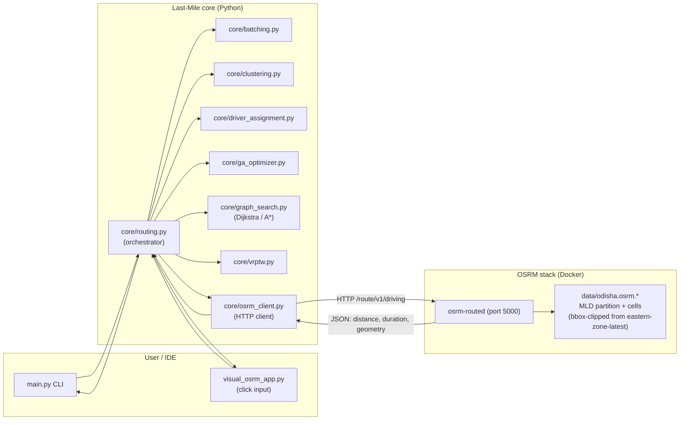
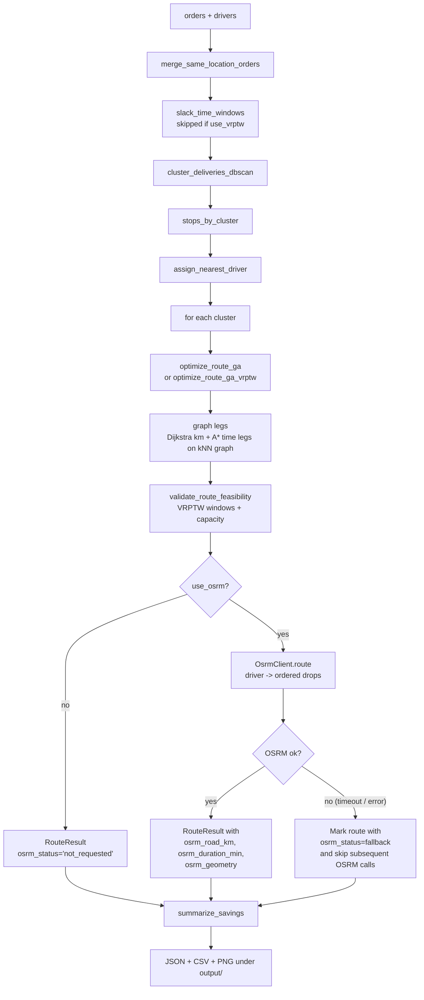
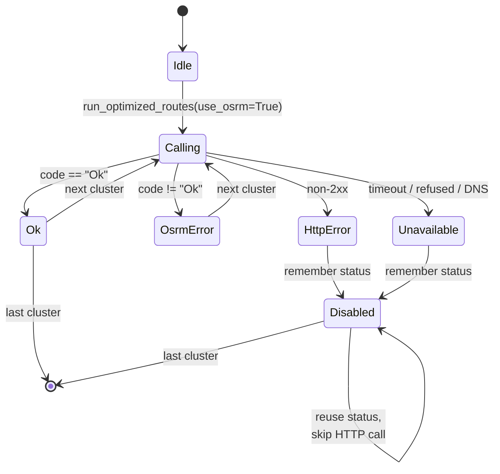
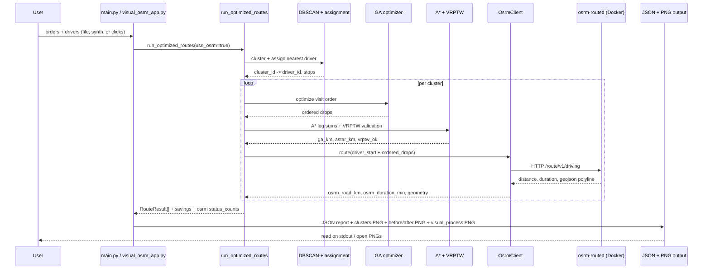

# Last-Mile (Chitra)

**Last-Mile** is a Python research/demo pipeline for **last-mile delivery optimization**. This repository is often worked on under the **Chitra** project folder name; the product behavior described here is the same.

In everyday terms: imagine many parcels must be dropped at different map locations, several drivers are available, and each customer cares about *when* the parcel arrives and how heavy it is. This program **groups nearby drops**, **picks which driver serves which group**, **decides the order of stops** to reduce driving, **checks** that times and truck capacity still work, and optionally asks a **real road router** (OSRM) how far and long the drive would actually be. Everything is **saved** as **CSV** and **JSON** so you can open results in Excel or downstream tools, and figures go under **`output/images/`** with matching timestamps.

Technically it stitches together **spatial batching and clustering**, **nearest-driver assignment**, a **genetic algorithm (GA)** for stop order inside each cluster (distance-only by default, or **time-window-aware** with `--use-vrptw`), **graph shortest paths** (Dijkstra as the authoritative graph km; A\* for fastest-time-style legs on the same graph), **VRPTW validation** (and optional GA that respects windows), **matplotlib** maps (with optional **OpenStreetMap** tiles), plus structured **JSON** and flat **CSV** exports.

It integrates with a **local OSRM** (Open Source Routing Machine) server so the GA-chosen visit order can be evaluated as a real **road route**, and ships a **graphical click-based input → process → output app**.

The default entry point runs on **synthetic** orders and drivers centered on an **Odisha / Bhubaneswar-like region** (~20.30°N, 85.82°E). The OSRM stack uses a **bbox-clipped Odisha PBF** (from Geofabrik's `eastern-zone-latest` via `osmium-tool`) so the road network matches the demo area with a small ~37 MB PBF and a quick MLD build, including on Apple Silicon.

---

## Table of contents

1. [Plain-language guide (start here)](#plain-language-guide-start-here)
2. [What the pipeline does](#what-the-pipeline-does)
3. [Every file and module (what it does and why)](#every-file-and-module-what-it-does-and-why)
4. [Algorithms in one place](#algorithms-in-one-place)
5. [CSV and JSON: loading data and saving results](#csv-and-json-loading-data-and-saving-results)
6. [VRPTW: two roles (check vs optimize)](#vrptw-two-roles-check-vs-optimize)
7. [System architecture (with diagrams)](#system-architecture-with-diagrams)
8. [OSRM integration](#osrm-integration)
9. [OSRM Optional Mode](#osrm-optional-mode)
10. [Graphical input → process → output app](#graphical-input--process--output-app)
11. [Repository layout](#repository-layout)
12. [Requirements and installation](#requirements-and-installation)
13. [How to run](#how-to-run)
14. [Input data shape (orders and drivers)](#input-data-shape-orders-and-drivers)
15. [End-to-end process (stage by stage)](#end-to-end-process-stage-by-stage)
16. [How Last-Mile and OSRM work together](#how-Last-Mile-and-osrm-work-together)
17. [Libraries: what each is for and where it appears](#libraries-what-each-is-for-and-where-it-appears)
18. [Outputs](#outputs)
19. [Default synthetic parameters](#default-synthetic-parameters-mainpy)
20. [Future upgrades](#future-upgrades)
21. [License / attribution](#license--attribution)

---

## Plain-language guide (start here)

**The story.** Delivery companies waste fuel when drivers zig-zag. This code is a *research prototype* that mimics a small piece of a real dispatch system: group stops that are close, assign a driver, reorder stops intelligently, then double-check constraints (time windows, capacity) and optionally measure true road distance.

**Inputs you can use.**

- **Synthetic data** (built-in random-ish orders near Bhubaneswar).
- **CSV files** for real or sample tabular data (`data/sample_orders.csv`, `data/sample_drivers.csv`, and `sample_orders_vrptw.csv` for strict time preferences).

**Outputs you get.**

- **Printed JSON** on the terminal (full report for the run).
- **A JSON file** under `output/json/pipeline_run_<UTC_stamp>.json` (same content, easy to archive).
- **A CSV file** under `output/csv/pipeline_run_<UTC_stamp>.csv` — one row per optimized route, with the same timestamp as the JSON so they pair up.
- **PNG maps** under `output/images/` (cluster view, before/after comparison, and presenter or visual-app frames when you use those modes).

**Optional extras.**

- **`--use-osrm`**: ask a local road engine for real driving distance, time, and map polylines. If the server is off, the run still finishes using straight-line and graph estimates.
- **`--use-vrptw`**: make the genetic optimizer *care* about delivery time windows when choosing order (default mode only checks windows *after* ordering).
- **`--viz-mode map`**: draw OpenStreetMap tiles under your data when **contextily** can fetch tiles (disable with `CHITRA_NO_BASEMAP=1` for offline/tests).

---

## What the pipeline does

At a high level:

1. **Merge** orders that share the same drop coordinate (within rounded lat/lon).
2. Optionally **slack** time windows to ease feasibility after merges (**skipped** when `--use-vrptw` is on so your windows stay exact).
3. **Cluster** merged stops with **DBSCAN** in geographic space (Haversine metric).
4. **Assign** each cluster to the **nearest** driver by Haversine centroid-to-driver distance.
5. For each cluster, **optimize visit order** with a **GA** (permutation-encoded open tour from the assigned driver). With **`--use-vrptw`**, the GA uses **`optimize_route_ga_vrptw`** (penalizes lateness); otherwise **`optimize_route_ga`** minimizes distance-like fitness only.
6. **Evaluate** chained route length on a **k-NN geographic graph** using **Dijkstra** per leg for summed graph km, and **A\*** per leg for fastest-time-style legs and ETAs (**legs are compared** so you can see Dijkstra vs A\* agreement).
7. **Optionally evaluate the same ordered route on the real road network via OSRM** to obtain road km, driving duration, and a polyline geometry to plot.
8. **Validate** the proposed sequence with a lightweight **VRPTW** forward simulator (capacity, windows, service time, max tour length).
9. Emit **comparison metrics** versus a naive baseline (each stop served independently by its closest driver).
10. **Write CSV + JSON** artifacts and **plot** clusters/routes and naive vs optimized geometry; optional **slideshow** presenter or **graphical click-input app**.

Greedy dynamic batching is also computed (from raw orders) to illustrate streaming-style wave partitioning; the main routing pipeline in `run_optimized_routes` calls it mainly for methodological alignment (see `core/routing.py`).

---

## Every file and module (what it does and why)

| Module | Plain explanation | Why it exists |
|--------|-------------------|---------------|
| **`main.py`** | Command-line front door: parses flags, loads synthetic or **CSV** data, runs the pipeline or visual apps, writes **CSV/JSON/PNGs**, prints JSON. | One place to run experiments without writing Python scripts. |
| **`pipeline_csv_log.py`** | Builds the **JSON report** dict, writes **pretty JSON** files, and flattens per-route metrics into a **CSV** with stable columns (`FIELDNAMES`). Also defines `output/csv`, `output/json`, `output/images` helpers and UTC run stamps. | Analysts and BI tools prefer CSV; developers prefer JSON; both stay **in sync** per run. |
| **`utils.py`** | Earth-distance (**Haversine**), region center, **synthetic** order/driver factories, **`load_orders_csv` / `load_drivers_csv`**, and **matplotlib** plots (`plot_clusters_and_routes`, `plot_before_after`) delegated to **map_basemap** for tiles. | Centralizes geography math and shared plotting; CSV loaders enforce strict headers so bad files fail fast. |
| **`map_basemap.py`** | Chooses **`graph`** (grid only) vs **`map`** (OSM tiles via **contextily**). Reads **`CHITRA_VIZ_MODE`** and **`CHITRA_NO_BASEMAP`**. | Makes maps readable for non-experts (satellite-like context) without forcing a heavy dependency path when tiles fail. |
| **`core/routing.py`** | **`run_optimized_routes`**: orchestrates merge → cluster → assign → GA → graph metrics → VRPTW check → optional OSRM; builds **`RouteResult`** rows and **`pipeline` summary** (OSRM + VRPTW blocks). **`summarize_savings`** compares naive vs optimized km. **`select_route_polyline`** picks OSRM vs straight line for drawing. | This is the **conductor** of the whole show; keeps stages composable and testable. |
| **`core/batching.py`** | **`merge_same_location_orders`**: combines identical-drop orders. **`greedy_dynamic_batch`**: streaming-style batching demo from raw orders. | Merging reduces duplicate stops; batching shows an alternative “wave” mindset used in online dispatch papers. |
| **`core/clustering.py`** | **`cluster_deliveries_dbscan`**: density clustering on lat/lon (sklearn **DBSCAN**, Haversine metric); noise relabeled so every stop belongs to some group. | Groups “deliver here, here, and here today” into one driver tour without manual zoning. |
| **`core/driver_assignment.py`** | **`stops_by_cluster`**, **`assign_nearest_driver`**: centroid of cluster vs driver locations. | Simple, fast **first pass** assignment; good baseline before more advanced fleet assignment. |
| **`core/ga_optimizer.py`** | **`optimize_route_ga`**: DEAP genetic search over visit permutations (PMX crossover, shuffle mutation, tournament selection, elite). **`optimize_route_ga_vrptw`**: same machinery but fitness adds **lateness** and **waiting** penalties. **`tour_distance_km`**: reports true Haversine tour length. | Exact TSP/VRPTW is expensive; GA explores many orders under a time budget and often finds strong routes. |
| **`core/graph_search.py`** | Builds a **k-nearest-neighbor geographic graph** (NetworkX), runs **Dijkstra** shortest path by km, and a custom **A\*** fastest-time-style path using a heuristic. | Graph path length is a richer proxy than summing raw great-circle legs when intermediate waypoints matter on sparse graphs. |
| **`core/vrptw.py`** | **`VRPTWConfig`**, **`travel_time_min`**, **`validate_route_feasibility`** (forward simulation with capacity + windows), **`slack_time_windows`** (widen windows for demo stability when not in VRPTW optimize mode). | Answers “**Is this ordered route actually legal?**” without claiming globally optimal VRPTW. |
| **`core/osrm_client.py`** | Small **urllib** HTTP client: health check, `/route/v1/driving`, lon/lat flips, status enums. | Keeps road routing **optional** and dependency-light (no `requests` required for the core app, though `requests` is listed for tests/tooling). |
| **`visual_presenter.py`** | Step-by-slide matplotlib walkthrough (`present_full_pipeline`). | Teaching / demos — shows *why* each stage changed the map. |
| **`visual_osrm_app.py`** | Click orders/drivers, **Run pipeline**, optional OSRM, VRPTW toggle, sample CSV load; writes the same **CSV/JSON** pattern as CLI. | Hands-on exploration without editing code. |
| **`simulator.py`** | Scripted toy scenarios (`run_all`) for edge cases. | Regression / sanity narratives in JSON output. |
| **`tests/`** | e.g. `test_osrm_optional_behavior.py` stubs OSRM and checks fallbacks. | Protects optional-mode contracts when refactoring. |
| **`OSRM/`** | Docker + shell scripts + `tests/test_osrm_api.py` for a local server. | Turns OpenStreetMap into driveable metrics Last-Mile can query. |
| **`data/*.csv`** | Sample orders/drivers (including **`sample_orders_vrptw.csv`** with **`preferred_minute`** for tight demos). | Copy/paste templates for your own experiments. |

---

## Algorithms in one place

| Idea | Type | What problem it solves | Why this choice |
|------|------|------------------------|-----------------|
| **Merge by rounded coordinate** | Heuristic | Duplicate pins at the same building | Avoids double-counting stops and aligns with map snapping noise. |
| **DBSCAN** | Classic clustering (Ester et al.) | “Which drops are geographically one run?” | Handles irregular shapes; no need to pre-specify cluster count. |
| **Nearest centroid → driver** | Greedy assignment | “Which driver owns this blob?” | Simple and interpretable baseline. |
| **Genetic algorithm (DEAP)** | Metaheuristic | **Stop order** is a huge permutation search space | Flexible; easy to change fitness (distance vs VRPTW penalty). |
| **k-NN geographic graph** | Graph construction | Connect nearby points as “roads” in the abstract | Keeps graph sparse for speed while approximating coherent chains. |
| **Dijkstra** | Shortest path (non-negative edges) | Minimum **km** on that graph between two stops | Standard, trustworthy baseline for “graph distance.” |
| **A\*** | Heuristic search | Faster-than-blind search toward a goal with admissible heuristic | Here used for **fastest-time** flavored legs on the same graph (see `astar_fastest_path`). |
| **VRPTW forward check** | Deterministic simulation | After ordering: “capacity + windows + duration OK?” | O(stops) — cheap sanity check; no exponential exact solver needed for the demo. |
| **OSRM MLD** | External engine | Real road distance/time/geometry | Ground truth for maps; optional so core works offline. |

---

## CSV and JSON: loading data and saving results

**Why CSV and JSON together?** JSON is nested and precise — good for programs. CSV is flat — good for spreadsheets and quick charts. Last-Mile writes **both** with the **same UTC timestamp** in the filename so you always know which rows belong to which run.

### Reading inputs (CSV → Python dicts)

- **`utils.load_orders_csv(path)`** expects a header **exactly** matching either:
  - nine columns: `order_id`, `user_id`, `pickup_lat`, `pickup_lon`, `drop_lat`, `drop_lon`, `tw_start_min`, `tw_end_min`, `parcel_weight`, or
  - those nine **plus** optional `preferred_minute` (minutes since midnight, 0–1439) for labeling **preferred** delivery times on reports.
- **`utils.load_drivers_csv(path)`** expects: `driver_id`, `current_lat`, `current_lon`, `capacity`.

The CLI requires **both** paths together:

```bash
python main.py --orders-csv data/sample_orders.csv --drivers-csv data/sample_drivers.csv
```

The same pair works with `--visual-input` to preload the map app.

### Writing outputs (every CLI or visual “Run pipeline”)

| Artifact | Location | Contents (plain words) |
|----------|----------|-------------------------|
| **JSON** | `output/json/pipeline_run_<stamp>.json` | Clustering, per-route metrics, savings totals, simulator block, and `pipeline` metadata (OSRM + VRPTW summary). |
| **CSV** | `output/csv/pipeline_run_<stamp>.csv` | One **row per optimized route** (cluster); repeated columns for run-level totals so each row is self-contained for Excel pivots. Includes `vrptw_detail_json`, ETAs, OSRM fields, and effective distance/source. |
| **Images** | `output/images/` | e.g. `clusters_routes_<stamp>.png`, `before_after_<stamp>.png`, presenter frames, or `osrm_visual_process_<stamp>.png` from the GUI. |

Helpers live in **`pipeline_csv_log.py`**: `build_pipeline_report_dict`, `save_pipeline_report_json`, `write_pipeline_run_csv`, `new_run_stamp_utc`.

Stdlib **`csv`** and **`json`** are used — no pandas required for these paths.

---

## VRPTW: two roles (check vs optimize)

**VRPTW** stands for **Vehicle Routing Problem with Time Windows**: each stop may only be served between a **start** and **end** time, and the vehicle has **limited capacity**.

This codebase uses VRPTW in **two different ways**:

1. **Always-on feasibility check — `validate_route_feasibility` (`core/vrptw.py`)**  
   After a route is chosen, the code **plays the route forward in time**: drive → arrive → wait if early → serve → repeat. If you miss a window or exceed capacity, `vrptw_ok` is false and `vrptw_detail` lists violations. **Reason:** cheap, clear pass/fail for any sequence.

2. **Optional GA mode — `--use-vrptw` + `optimize_route_ga_vrptw` (`core/ga_optimizer.py`)**  
   The genetic algorithm’s fitness adds **large penalties for arriving late** and smaller penalties for **idle waiting**. **Reason:** distance-only GA might put a “far but urgent” stop last; VRPTW-aware GA biases order toward **hitting deadlines**, even if total kilometers rise slightly.

**Interaction with time windows after merging.**  
When **`--use-vrptw` is off**, `run_optimized_routes` may **widen** windows with `slack_time_windows(..., pad_min=45)` so merged stops rarely get impossible intersections. When **`--use-vrptw` is on**, that slack is **skipped** so your CSV windows reflect your real intent.

**`preferred_minute` in CSV.**  
Loaded into each order dict when present; the pipeline carries **`preferred_minute_ordered`** on each `RouteResult` for reporting (the strict feasibility rules still use `time_window`).

---

## System architecture (with diagrams)

### High-level component diagram



### Data flow inside `run_optimized_routes` (with OSRM)



---

## OSRM integration

OSRM (Open Source Routing Machine) is plugged in as an **optional, drop-in road-network evaluator**. The GA still chooses the visit **order** inside each cluster, A\* still benchmarks the chained Haversine-on-graph distance, and the VRPTW simulator still validates feasibility — but with `--use-osrm`, the very same ordered visit sequence is **also routed on the real road graph** through the OSRM HTTP API. Last-Mile never falls over if OSRM is missing: the OSRM client returns a structured status, the pipeline logs that status per route, and the existing GA/A\* metrics remain authoritative.

### What the local OSRM stack provides

The `OSRM/` folder contains a turnkey Docker setup:

| File | Role |
|------|------|
| `OSRM/docker-compose.yml` | Runs `osrm/osrm-backend:latest` (pinned `platform: linux/amd64`) with `osrm-routed --algorithm mld` on container port `5000`, bound to `./data/odisha.osrm` by default. Override `OSRM_MAP_STEM` (e.g. `eastern-zone-latest`, `india-latest`) to point at any other built dataset. Healthchecked via `/health`. |
| `OSRM/scripts/download_map.sh` | Idempotently downloads the source OSM extract from Geofabrik. When `OSRM_MAP_STEM=odisha` (the default) it fetches `eastern-zone-latest.osm.pbf` because Geofabrik does not publish a standalone Odisha extract. |
| `OSRM/scripts/clip_to_bbox.sh` | Uses `osmium-tool` (native if installed, else the `iboates/osmium` Docker image) to clip a source PBF to a bounding box. Defaults clip `eastern-zone-latest.osm.pbf` → `odisha.osm.pbf` (~37 MB). Override `OSRM_BBOX`, `OSRM_SOURCE_STEM`, `OSRM_MAP_STEM` for other regions. |
| `OSRM/scripts/build_osrm.sh` | Runs the **MLD pipeline** (`osrm-extract` → `osrm-partition` → `osrm-customize`) for `${OSRM_MAP_STEM:-odisha}`. If the chosen PBF is missing but a source PBF (`OSRM_SOURCE_STEM`) exists, it transparently invokes `clip_to_bbox.sh` first. |
| `OSRM/scripts/run_server.sh` | Starts the container via `docker-compose up -d`, then polls `http://localhost:5000/health` until ready. |
| `OSRM/scripts/stop_server.sh` | Brings the container down. |
| `OSRM/tests/test_osrm_api.py` | Smoke tests the `/health`, `/route/v1`, `/table/v1`, `/nearest/v1` endpoints with Odisha (Bhubaneswar-area) sample coordinates. |

### One-time bring-up

```bash
cd OSRM
./scripts/download_map.sh         # fetches eastern-zone-latest.osm.pbf (~242 MB)
./scripts/clip_to_bbox.sh         # carves out odisha.osm.pbf (~37 MB) — needs osmium-tool (brew install osmium-tool) or Docker
./scripts/build_osrm.sh           # extract + partition + customize on odisha.osm.pbf
./scripts/run_server.sh           # boots osrm-routed on http://localhost:${OSRM_HOST_PORT:-5001}
python tests/test_osrm_api.py     # optional smoke test
```

`build_osrm.sh` will transparently call `clip_to_bbox.sh` if `data/odisha.osm.pbf` is missing but `data/eastern-zone-latest.osm.pbf` exists, so the explicit clip step is optional.

The default flow downloads `eastern-zone-latest.osm.pbf` (~242 MB), clips it to an Odisha bounding box producing `odisha.osm.pbf` (~37 MB), then runs `osrm-extract`/`osrm-partition`/`osrm-customize` on the clipped file. End-to-end this finishes in **~1 minute** on Apple Silicon (vs an OOM crash on the full eastern-zone under x86 emulation). Once `osrm-routed` is healthy (Docker maps container port `5000` to host `${OSRM_HOST_PORT:-5001}`), Last-Mile will use it whenever you pass `--use-osrm` and point `--osrm-url` at that host port.

To target a different region, set both env vars together, for example:

```bash
OSRM_MAP_STEM=goa OSRM_SOURCE_STEM=western-zone-latest \
OSRM_BBOX=73.65,14.85,74.35,15.85 ./scripts/build_osrm.sh
```

### Last-Mile's OSRM HTTP client — `core/osrm_client.py`

Last-Mile speaks to OSRM through a tiny, dependency-free client built on `urllib`:

| Symbol | Purpose |
|--------|---------|
| `OsrmClient(base_url, timeout_seconds)` | Holds the OSRM base URL (default `http://localhost:5000`) and a per-request timeout (default `4.0` s). |
| `OsrmClient.route(points)` | Calls `GET /route/v1/driving/{coords}?overview=full&geometries=geojson&steps=false&alternatives=false` over the supplied **lat,lon** waypoints, in order. |
| `OsrmRoute` (dataclass) | Frozen result with `road_km`, `duration_min`, `geometry` (lat,lon polyline), `status`, optional `code`, `message`, and an `ok` property. |

A few important details:

- **Coordinate ordering**: Last-Mile stores `(lat, lon)` everywhere; OSRM's REST API expects `lon,lat`. The client is the only place that conversion lives, so the rest of the codebase stays consistent.
- **Geometry round-trip**: when OSRM returns a `geojson` polyline, the client flips each `[lon, lat]` back into `(lat, lon)` so `visual_presenter.py`, `visual_osrm_app.py`, and `utils.plot_before_after` can plot it directly with their existing `(lat, lon)` conventions.
- **Status surface**: instead of raising on every network/transport error, the client returns one of four statuses on `OsrmRoute.status`:
  - `ok` — happy path; `road_km`, `duration_min`, and `geometry` are populated.
  - `osrm_error` — server returned `code != "Ok"` (e.g. `NoRoute`, `InvalidQuery`).
  - `http_error` — non-2xx HTTP response.
  - `unavailable` — DNS failure, refused connection, timeout, or malformed JSON. This is the case when OSRM simply isn't running.

### How `core/routing.py` consumes OSRM

`run_optimized_routes(..., use_osrm=False, osrm_base_url="http://localhost:5000")` was extended to:

1. Lazily construct a single `OsrmClient` when `use_osrm=True`.
2. After GA + A\* + VRPTW finish for a cluster, call `OsrmClient.route([driver_start] + ordered_drops)`.
3. Store the response on `RouteResult` as four new fields:
   - `osrm_road_km: float | None`
   - `osrm_duration_min: float | None`
   - `osrm_geometry: list[(lat, lon)] | None`
   - `osrm_status: str` (default `"not_requested"`)
4. **Short-circuit on transport failure**: if a call ever returns `unavailable` or `http_error`, the orchestrator records that status, **stops issuing more OSRM requests for this run**, and tags every remaining cluster with the same fallback status. This avoids 4 s × N timeouts when the server is offline.
5. Aggregate per-status counts into the pipeline summary:

```jsonc
"pipeline": {
  "merged_stop_count": 24,
  "clusters": 7,
  "merge_map": { ... },
  "osrm": {
    "requested": true,
    "base_url": "http://localhost:5000",
    "connected": true,                 // result of the preflight probe
    "mode": "core_plus_osrm",         // "core_only" | "core_plus_osrm"
    "reason": "connected",            // "not_requested" | "connected" | "unavailable" | "http_error" | "osrm_error"
    "status_counts": { "ok": 7 },     // per-route status histogram
    "enriched_routes": 7,             // # routes that received OSRM road km/duration
    "total_routes": 7
  }
}
```

### `summarize_savings` adds an OSRM track

When all clusters have a numeric `osrm_road_km`, `summarize_savings` adds two more numbers alongside the existing GA and A\* totals:

| Key | Meaning |
|-----|---------|
| `optimized_osrm_road_km` | Sum of road-network km across all optimized routes. |
| `saved_km_vs_naive_osrm` | `max(0, naive_sum_legs_km - optimized_osrm_road_km)`. |

If any route's OSRM call failed, `optimized_osrm_road_km` reports `0.0` so the totals stay honest about the partial result.

### OSRM client state machine



### Sequence diagram: a single OSRM-evaluated cluster

```mermaid
sequenceDiagram
    autonumber
    participant CLI as main.py / visual_osrm_app.py
    participant ROUT as run_optimized_routes
    participant GA as optimize_route_ga
    participant AST as astar_tour_length
    participant VRP as validate_route_feasibility
    participant OC as OsrmClient
    participant SRV as osrm-routed (Docker)

    CLI->>ROUT: orders, drivers, use_osrm=True
    ROUT->>GA: cluster coords + driver start
    GA-->>ROUT: ordered visit permutation
    ROUT->>AST: chained legs on kNN graph
    AST-->>ROUT: ga_km, astar_km, leg diagnostics
    ROUT->>VRP: ordered drops + windows + capacity
    VRP-->>ROUT: vrptw_ok, detail
    ROUT->>OC: route([driver_start, drop1, ..., dropN])
    OC->>SRV: GET /route/v1/driving/lon,lat;...
    SRV-->>OC: { code:"Ok", routes:[{distance, duration, geometry}] }
    OC-->>ROUT: OsrmRoute(road_km, duration_min, geometry, "ok")
    ROUT-->>CLI: RouteResult with all metrics + JSON summary
```

---

## OSRM Optional Mode

OSRM is wired in as a **best-use enhancement layer**, never a hard dependency. Everything in `core/` — DBSCAN, nearest-driver assignment, GA sequencing, A\*/Dijkstra graph search, VRPTW feasibility — runs identically whether OSRM is installed, running, partially failing, or completely down.

### What this mode does

- **Preflights OSRM once per run.** Before the route loop, `run_optimized_routes` issues a fast `nearest/v1/driving` probe with a tight timeout. The result is cached on the pipeline summary (`pipeline.osrm.connected` + `pipeline.osrm.reason`).
- **Enriches per route when reachable.** When the probe succeeds, the GA-chosen visit order for each cluster is also routed via OSRM to add `osrm_road_km`, `osrm_duration_min`, and a polyline `osrm_geometry` to the `RouteResult`.
- **Surfaces an "effective metric" on every route.** Each `RouteResult` exposes four additive fields that pick the best-available source for downstream reports/plots:
  - `effective_distance_km` — picked from OSRM → **Dijkstra graph km** → GA proxy in that order.
  - `effective_duration_min` — OSRM duration when present; otherwise distance ÷ 25 km/h proxy.
  - `effective_distance_source` — `osrm` | `dijkstra` | `ga_proxy`.
  - `effective_time_source` — `osrm` | `proxy`.
- **Reports coverage.** `pipeline.osrm.enriched_routes / total_routes` tells you how many routes got real road metrics, even on partial-failure runs.
- **Prints status to the console.** See [example logs](#example-logs) below.

### What this mode does NOT do

- It does **not** change the GA, A\*, Dijkstra, VRPTW, or DBSCAN behavior. The visit order, driver assignment, and feasibility checks are identical with OSRM on or off.
- It does **not** modify any existing JSON keys. Every new field (`pipeline.osrm.connected`, `pipeline.osrm.mode`, `pipeline.osrm.reason`, `pipeline.osrm.enriched_routes`, `pipeline.osrm.total_routes`, the four `effective_*` fields per route) is **additive**.
- It does **not** retry or wait for OSRM. Preflight is a single short call; if it fails, the run uses core routing immediately.
- It does **not** silently swallow OSRM problems. The reason is always recorded on `pipeline.osrm.reason` and `route.osrm_status`, and printed to stdout.

### Fallback behavior

| Situation | Behavior |
|-----------|---------|
| `--use-osrm` not passed | `mode=core_only`, `reason=not_requested`. Every route reports `osrm_status="not_requested"`. |
| Server unreachable at startup (DNS/refused/timeout) | Preflight returns `unavailable`. **No** `/route/v1/driving` calls are issued at all (no per-route timeout penalty). `mode=core_only`, `reason=unavailable`. |
| Server returns HTTP 5xx at startup | Preflight returns `http_error`. Same fallback as above with `reason=http_error`. |
| Server is up but rejects a specific route (`code != "Ok"`, e.g. `NoRoute`) | That route gets `osrm_status="osrm_error: ..."`; the orchestrator **does not** disable OSRM for the rest of the run. |
| Server crashes mid-run | First transport-level failure (`unavailable` / `http_error`) trips a one-way circuit breaker. Remaining routes inherit the same status without a network call. `mode` remains `core_plus_osrm` if at least one route was enriched, otherwise drops to `core_only`. |

In all cases the route count is unchanged, every route gets effective distance/time numbers, and `pipeline.osrm` carries enough information to explain *why* OSRM did or did not contribute.

### Example logs

**`--use-osrm` off (default):**

```text
$ python main.py
OSRM: not requested (pass --use-osrm to enable road enrichment)
{ ...JSON report... }
Figures written: .../output/images/clusters_routes_<stamp>.png .../output/images/before_after_<stamp>.png
```

`pipeline.osrm` block in the JSON:

```jsonc
"osrm": {
  "requested": false,
  "base_url": null,
  "connected": false,
  "mode": "core_only",
  "reason": "not_requested",
  "status_counts": { "not_requested": 7 },
  "enriched_routes": 0,
  "total_routes": 7
}
```

**`--use-osrm` on, server **connected**:**

```text
$ python main.py --use-osrm --osrm-url http://localhost:5000
OSRM: requested at http://localhost:5000 (preflight pending...)
OSRM: connected (mode=core_plus_osrm)
{ ...JSON report... }
Figures written: .../output/images/clusters_routes_<stamp>.png .../output/images/before_after_<stamp>.png
OSRM enriched routes: 7/7
```

`pipeline.osrm` block in the JSON:

```jsonc
"osrm": {
  "requested": true,
  "base_url": "http://localhost:5000",
  "connected": true,
  "mode": "core_plus_osrm",
  "reason": "connected",
  "status_counts": { "ok": 7 },
  "enriched_routes": 7,
  "total_routes": 7
}
```

**`--use-osrm` on, server **not connected**:**

```text
$ python main.py --use-osrm --osrm-url http://localhost:5000
OSRM: requested at http://localhost:5000 (preflight pending...)
OSRM: not connected (unavailable), using core routing
{ ...JSON report... }
Figures written: .../output/images/clusters_routes_<stamp>.png .../output/images/before_after_<stamp>.png
OSRM enriched routes: 0/7
```

`pipeline.osrm` block in the JSON:

```jsonc
"osrm": {
  "requested": true,
  "base_url": "http://localhost:5000",
  "connected": false,
  "mode": "core_only",
  "reason": "unavailable",
  "status_counts": { "unavailable: <urlopen error ...>": 7 },
  "enriched_routes": 0,
  "total_routes": 7
}
```

**Mid-run failure (partial enrichment):** `pipeline.osrm.mode` stays `core_plus_osrm`, `pipeline.osrm.enriched_routes` < `total_routes`, and `status_counts` carries both `"ok"` and the failure reason key.

### Visual surfacing

- The `--present` slideshow's slide 6 ("Navigation · OSRM/A\* · VRPTW") prints `OSRM road geometry: connected (X/Y)` or `OSRM road geometry: not connected (reason)`. Slide 8's subtitle echoes the same.
- The click-based `--visual-input` app shows OSRM status in its panel and on the figure subtitle. PNG path: `output/images/osrm_visual_process_<stamp>.png`. Route polylines fall back to the straight-line `driver → ordered drops` chain whenever OSRM geometry is missing or a degenerate near-zero-length artifact.

### Tests covering the optional behavior

`tests/test_osrm_optional_behavior.py` runs offline (it stubs `OsrmClient.health_check` / `OsrmClient.route`) and exercises:

- core-only with `--use-osrm` off,
- full enrichment with `--use-osrm` on + healthy server,
- immediate fallback with `--use-osrm` on + server down at start,
- partial enrichment + circuit-breaker trip with `--use-osrm` on + mid-run failure,
- the visual status label and the safe polyline selector.

Run them with:

```bash
pytest tests/test_osrm_optional_behavior.py -v
```

---

## Graphical input → process → output app

`visual_osrm_app.py` opens a Matplotlib window where you build the routing problem **by clicking** and watch the same `run_optimized_routes` pipeline render its results back graphically.

```mermaid
flowchart LR
    subgraph Stage1[1. Graphical input]
        L1[Click Order mode]
        L2[Click Driver mode]
        L3[Click Load sample]
        L4[Click Reset]
    end
    subgraph Stage2[2. Click Run pipeline]
        P1[merge_same_location_orders]
        P2[cluster_deliveries_dbscan]
        P3[stops_by_cluster + assign_nearest_driver]
        P4[run_optimized_routes use_osrm=True]
    end
    subgraph Stage3[3. Visual output panel]
        O1[Input: orders + drivers]
        O2[Process: clusters + assignment dashed lines]
        O3[Output: optimized polylines<br/>OSRM road geometry when available]
        O4[Footer: GA km, A* km, OSRM km, status counts]
        O5[PNG saved under output/images/]
    end

    Stage1 --> Stage2 --> Stage3
```



Run it:

```bash
python main.py --visual-input --osrm-url http://localhost:5000
```

Buttons (rendered along the bottom of the window):

| Button | Behavior |
|--------|----------|
| **Order mode** | Subsequent map clicks add a new order with `parcel_weight=1.0`, time window `09:00–18:00`, and the click point as `drop`. |
| **Driver mode** | Subsequent map clicks add a new driver with `capacity=30.0` and the click point as `current_location`. |
| **Load sample** | Loads **`data/sample_orders.csv`** or **`data/sample_orders_vrptw.csv`** (when VRPTW mode is on) plus **`data/sample_drivers.csv`**, or synthetic fallback if files are missing. |
| **Run pipeline** | Calls `run_optimized_routes(..., use_osrm=True)` against the configured OSRM URL and pops a 3-panel result figure. |
| **Reset** | Clears all orders and drivers. |

The right-hand info panel lists mode, counts, OSRM URL, artifact paths (`output/csv/...`, `output/json/...`, `output/images/...`), and savings when available.

---

## Repository layout

| Path | Role |
|------|------|
| `main.py` | CLI: synthetic or **CSV** inputs; flags `--present`, `--use-osrm`, `--use-vrptw`, `--visual-input`, `--viz-mode`; writes **`output/csv`**, **`output/json`**, **`output/images`**; prints JSON. |
| `pipeline_csv_log.py` | **`build_pipeline_report_dict`**, **`save_pipeline_report_json`**, **`write_pipeline_run_csv`**, UTC stamps, directory helpers. |
| `map_basemap.py` | **`graph`** vs **`map`** plots; optional **contextily** OSM tiles; env **`CHITRA_VIZ_MODE`**, **`CHITRA_NO_BASEMAP`**. |
| `data/sample_orders.csv` | Example orders (core columns); region aligned with demos. |
| `data/sample_orders_vrptw.csv` | Example orders including **`preferred_minute`** and tighter windows for VRPTW demos. |
| `data/sample_drivers.csv` | Example drivers (`driver_id`, position, `capacity`). |
| `output/csv/` | Timestamped **`pipeline_run_*.csv`** (one row per route + run-level columns). |
| `output/json/` | Timestamped **`pipeline_run_*.json`** (full structured report). |
| `output/images/` | Timestamped PNGs: **`clusters_routes_*.png`**, **`before_after_*.png`**, presenter **`pipeline_present_*`**, visual app **`osrm_visual_process_*`**. |
| `core/batching.py` | `merge_same_location_orders`, `greedy_dynamic_batch`. |
| `core/clustering.py` | `cluster_deliveries_dbscan` (sklearn DBSCAN, Haversine). |
| `core/driver_assignment.py` | `stops_by_cluster`, `assign_nearest_driver`. |
| `core/ga_optimizer.py` | `optimize_route_ga`, `optimize_route_ga_vrptw`, `tour_distance_km` (DEAP). |
| `core/graph_search.py` | kNN graph (**NetworkX**), **Dijkstra**, **A\*** fastest-time-style legs. |
| `core/vrptw.py` | `validate_route_feasibility`, `slack_time_windows`, `VRPTWConfig`. |
| `core/routing.py` | `run_optimized_routes`, `summarize_savings`, `RouteResult`, `cluster_route_graph_metrics`, `select_route_polyline`. |
| `core/osrm_client.py` | `OsrmClient`, `OsrmRoute` (stdlib HTTP). |
| `utils.py` | Haversine, synthetic generators, **`load_orders_csv`**, **`load_drivers_csv`**, plotting. |
| `simulator.py` | `run_all` toy scenarios for JSON demos. |
| `visual_presenter.py` | `present_full_pipeline` slideshow; writes under **`output/images/`** when driven from `main.py`. |
| `visual_osrm_app.py` | Click UI; VRPTW toggle; sample CSV load; same CSV/JSON artifact pattern as CLI. |
| `tests/` | Pytest modules (e.g. OSRM optional behavior). |
| `OSRM/` | Docker Compose, map download/clip/build scripts, API smoke test. |
| `requirements.txt` | Minimum versions for Python dependencies (see below). |

---

## Requirements and installation

**Python**: 3.11+ recommended (development used 3.13 in one environment).

```bash
cd /path/to/Chitra
python3 -m venv venv
source venv/bin/activate   # Windows (PowerShell): .\venv\Scripts\Activate.ps1
python -m pip install --upgrade pip
python -m pip install -r requirements.txt
```

### `requirements.txt` (verbatim minimums)

- `numpy>=1.24` — arrays for clustering, centroids, plotting.
- `pandas>=2.0` — **not imported** by first-party source today; kept for notebooks, analytics, or future ETL beside the stdlib CSV loaders.
- `networkx>=3.0` — graph structure and **Dijkstra** in `core/graph_search.py`.
- `scikit-learn>=1.3` — **DBSCAN** in `core/clustering.py`; **SciPy** is pulled in transitively.
- `scipy>=1.11` — ensures a compatible SciPy alongside scikit-learn (not always imported directly).
- `matplotlib>=3.7` — all figures (`utils.py`, `visual_presenter.py`, `visual_osrm_app.py`).
- `deap>=1.4` — genetic algorithm toolbox in `core/ga_optimizer.py`.
- `contextily>=1.6.0` — optional **OpenStreetMap** tiles under plots when `--viz-mode map` (see `map_basemap.py`); safely skipped if unset or offline.
- `pytest>=7.0` — running `tests/`.
- `requests>=2.28` — **OSRM** smoke test script (`OSRM/tests/test_osrm_api.py`) and convenient HTTP in dev; the in-app **`OsrmClient`** uses **stdlib `urllib`** so the core pipeline does not hard-depend on `requests`.

### OSRM (optional, only for `--use-osrm` and `--visual-input`)

The OSRM client itself uses only Python's standard library (`urllib`, `json`, `dataclasses`), so no extra `pip` dependencies are introduced. To actually serve roads, you need the local Docker stack documented in [OSRM integration](#osrm-integration):

- Docker + Docker Compose
- ~1 GB disk for the India OSM extract and MLD artifacts
- 4 GB+ RAM for the build step

If OSRM is not running, the pipeline still completes — every route is tagged with an `osrm_status` describing why (e.g. `unavailable: ...`) and the GA/A\* numbers remain valid.

---

## How to run

Run from repo root after activating `venv` and installing dependencies:

```bash
source venv/bin/activate
```

**Standard run** (writes **`output/csv/pipeline_run_<stamp>.csv`**, **`output/json/pipeline_run_<stamp>.json`**, **`output/images/clusters_routes_<stamp>.png`**, **`output/images/before_after_<stamp>.png`**; prints the same JSON to stdout):

```bash
python main.py
```

**Run from CSV** (both paths required):

```bash
python main.py --orders-csv data/sample_orders.csv --drivers-csv data/sample_drivers.csv
```

**Time-window-aware GA** (optimize stop order with lateness penalties, and **do not** widen merged windows):

```bash
python main.py --use-vrptw
```

Combine CSV + VRPTW + OSRM as needed, for example:

```bash
python main.py --orders-csv data/sample_orders_vrptw.csv --drivers-csv data/sample_drivers.csv --use-vrptw --use-osrm --osrm-url http://localhost:5001
```

**Visual walkthrough** (Matplotlib slides; pauses between steps if a display is available):

```bash
python main.py --present [--pause SECONDS] [--viz-mode map|graph]
```

Default pause is **2** seconds (`--pause`). Pass **`--use-vrptw`** / **`--use-osrm`** as for the non-presenter run.

**Use local OSRM** after GA sequencing:

```bash
python main.py --use-osrm --osrm-url http://localhost:5001
```

Default CLI **`--osrm-url`** is `http://localhost:5000`. Match this to your Docker host port (`OSRM_HOST_PORT` in `OSRM/scripts/run_server.sh` is often **5001**).

**Graphical input → process → output app**:

```bash
python main.py --visual-input [--orders-csv ... --drivers-csv ...] [--use-vrptw] --osrm-url http://localhost:5001 --viz-mode map
```

Use the buttons to add orders/drivers, **Load sample** (CSV under `data/` when VRPTW is on/off), **Run pipeline** (three-panel figure). Artifacts use the same **`pipeline_run_<stamp>`** / **`osrm_visual_process_<stamp>.png`** naming under **`output/`**.

**Headless / CI / SSH**: avoid blocking on interactive windows and still save presenter frames:

```bash
export Last-Mile_HEADLESS=1
python main.py --present
```

Presenter PNGs: **`output/images/pipeline_present_<stamp>_##_*.png`**.

**Simulations only** (JSON to stdout):

```bash
python -m simulator
```

**Presenter module directly**:

```bash
python visual_presenter.py
```

### CLI flags summary

| Flag | Default | Effect |
|------|---------|--------|
| `--present` | off | Run `visual_presenter.present_full_pipeline`; saves frames under `output/images/`. |
| `--pause SECONDS` | `2.0` | Time between presenter slides when a display is active. |
| `--use-osrm` | off | Evaluate optimized routes against a local OSRM server; prefer road geometry in plots when present. |
| `--use-vrptw` | off | Use **`optimize_route_ga_vrptw`**; skip post-merge window slack. |
| `--osrm-url URL` | `http://localhost:5000` | OSRM base URL for `--use-osrm` and `--visual-input`. |
| `--visual-input` | off | Launch the click-based app; short-circuits stdout JSON (still writes CSV/JSON when you run the pipeline from the app). |
| `--viz-mode graph|map` | from `CHITRA_VIZ_MODE` or **`map`** | `graph` = grid-only; `map` = OSM tiles via contextily when available. |
| `--orders-csv` / `--drivers-csv` | none | Load inputs from CSV (must pass **both**). |

---

## Input data shape (orders and drivers)

Last-Mile consumes plain **dict** records (as produced by `synthetic_orders` / `synthetic_drivers`, the `--visual-input` app, or your own loaders).

### Order dict (typical keys)

| Key | Type | Meaning |
|-----|------|--------|
| `order_id` | `int` | Unique id |
| `user_id` | `int` | Customer id |
| `pickup` | `(lat, lon)` | Origin (degrees) |
| `drop` | `(lat, lon)` | Destination (degrees) |
| `time_window` | `[start_min, end_min]` | Minutes-from-midnight style (consistent with synth generator) |
| `parcel_weight` | `float` | Load in kg (merged stops sum weights) |
| `preferred_minute` | `float`, optional | Preferred delivery minute (0–1439) from CSV; carried into `preferred_minute_ordered` on each route for reporting |

### Driver dict

| Key | Type | Meaning |
|-----|------|--------|
| `driver_id` | `int` | Vehicle id |
| `current_location` | `(lat, lon)` | Start position |
| `capacity` | `float` | Max cumulative parcel weight |

The `--visual-input` app emits records of this exact shape: clicked orders default to `parcel_weight=1.0`, `time_window=[540, 1080]`; clicked drivers default to `capacity=30.0`. For a tabular template, copy **`data/sample_orders.csv`** or **`data/sample_orders_vrptw.csv`** plus **`data/sample_drivers.csv`**.

---

## End-to-end process (stage by stage)

### 1. Same-location merging — `merge_same_location_orders` (`core/batching.py`)

- Buckets orders by `(round(lat, key_decimals), round(lon, key_decimals))` default **5** decimals.
- One **representative** row per bucket (lowest `order_id`).
- **Time window**: intersection of group windows; if empty, expands to hull of endpoints so downstream VRPTW can surface conflicts.
- **Weight**: sum of parcel weights.
- Returns merged list plus `order_id → representative_order_id` map.

### 2. Time window slack — `slack_time_windows` (`core/vrptw.py`)

When **`use_vrptw=False`** (default), `run_optimized_routes` **widens** merged stops’ windows by `pad_min` (**45** minutes) **in-place** so tight intersections after merging are less likely to confuse demos.

When **`use_vrptw=True`**, this slack is **not applied** — your CSV (or synthetic) windows are treated as authoritative so the VRPTW-aware GA optimizes against the real constraints.

### 3. Greedy dynamic batching — `greedy_dynamic_batch` (`core/batching.py`)

Processes **original** orders in arrival order:

- Keeps batches under `GreedyBatchConfig`: max spread from anchor (**2.5 km**), **90** minute time slack compatibility, **12** orders per batch.
- Used in routing for methodological demo; merges for routing still come from Rule 1.

### 4. DBSCAN clustering — `cluster_deliveries_dbscan` (`core/clustering.py`)

- Builds `numpy` array of `(lat, lon)`, converts to **radians** for sklearn (`metric='haversine'`).
- `eps` is converted from **km** to radians via `eps_km / EARTH_RADIUS_KM` (`EARTH_RADIUS_KM` in `utils.py`).
- `algorithm='ball_tree'`.
- **Noise** (`-1`) is remapped so every stop belongs to its own pseudo-cluster id (routing still partitions everything).

### 5. Cluster → driver assignment — `assign_nearest_driver` (`core/driver_assignment.py`)

- For each cluster, computes **mean lat/lon** of member drops (`numpy`).
- Picks driver minimizing Haversine **centroid → current_location**, tie-break **lower driver_id**.
- Does **not** enforce one-driver-one-cluster globally (multiple clusters may map to same driver depending on centroid geometry).

### 6. Genetic optimization per cluster — `optimize_route_ga` / `optimize_route_ga_vrptw` (`core/ga_optimizer.py`)

- **Encoding**: permutation of indices `{0 … n−1}` = visit order (**open tour** from driver start, no return leg).
- **DEAP**: `FitnessMinVRPTW` (weights `(-1,)` minimize), `IndividualPermGA` subtype of `list`.
- **Operators**: `tools.cxPartialyMatched`, `tools.mutShuffleIndexes` (`indpb=0.15`), `tools.selTournament` (`tournsize=3`), elite best individual each generation.
- **Distance-only mode** (`optimize_route_ga`): fitness combines **Haversine tour length**, time proxy, light fuel-style term; defaults `pop_size=100`, `generations=70`, `cx_prob=0.85`, `mut_prob=0.35`, `speed_kmh=25`.
- **VRPTW mode** (`optimize_route_ga_vrptw`, when `--use-vrptw`): same operators but fitness adds **heavy lateness** and mild **waiting** penalties; population is seeded ~30% with “earliest window first” permutations to start near feasible schedules; default `generations=100`.

### 7. Graph legs (Dijkstra + A\*) — `cluster_route_graph_metrics` (`core/routing.py`) + `core/graph_search.py`

- `build_geographic_graph`: nodes rounded to **9** decimals as graph keys; edges weighted by **Haversine km** (and travel-time weights for A\*).
- For **≤5** nodes, graph is **complete**; otherwise **k-NN with k=4** (bidirectional nearest neighbors added).
- **`dijkstra_shortest_path`**: **`networkx.single_source_dijkstra`** with `weight='km'` — summed leg km is the authoritative **graph chain length**.
- **`astar_fastest_path`**: custom **`heapq`** priority queue + heuristic — **fastest-time-style** legs and **ETA minutes** per stop (for `eta_arrival_min` / A\* km tallies).
- **Per leg**, Dijkstra km and A\* km are compared (`dijkstra_star_equal` on `RouteResult`).

### 8. VRPTW validation — `validate_route_feasibility` (`core/vrptw.py`)

Walks forward in time from driver start:

- Travel minutes = `(haversine_km / avg_speed_kmh) * 60`.
- Tracks cumulative **load** vs `capacity`.
- **Windows** anchored so `min(time_window starts)` defines time zero; late arrivals flagged.
- **Service** `service_time_min` per stop (**5** min default).
- **Max route duration** cap (**720** min default).

### 9. OSRM road evaluation (optional) — `OsrmClient.route` (`core/osrm_client.py`)

Triggered only when `run_optimized_routes(..., use_osrm=True)`:

- Builds the waypoint list `[driver_start] + ordered_drops` from the GA-chosen permutation.
- Calls `GET /route/v1/driving/{lon,lat;…}?overview=full&geometries=geojson&steps=false&alternatives=false` with a 4 s timeout.
- Converts OSRM's `distance` (m) → `road_km`, `duration` (s) → `duration_min`, and `[lon,lat]` polyline → `[(lat, lon), …]` for plotting.
- Stores `osrm_road_km`, `osrm_duration_min`, `osrm_geometry`, and `osrm_status` on the `RouteResult`.
- On `unavailable` / `http_error`, the orchestrator caches the failure status and skips remaining OSRM calls for the run.

### 10. Baselines and reporting — `summarize_savings`, `main.py`, `pipeline_csv_log.py`

- **Naive**: sum over stops of min driver→drop Haversine (independent legs, no chaining).
- **Optimized**: sums GA tour km, **Dijkstra** summed graph km per route (see `optimized_dijkstra_graph_km` / `optimized_astar_graph_km` in savings — the latter key aliases the same graph total for historical compatibility), per-leg **A\*** km tallies, and (when every route has OSRM) summed OSRM road km.
- `main.py` calls `simulator.run_all()`, prints JSON to stdout, and **`build_pipeline_report_dict` + `save_pipeline_report_json` + `write_pipeline_run_csv`** persist the same run under `output/json/` and `output/csv/` with a matching stamp.

---

## How Last-Mile and OSRM work together

Last-Mile and OSRM occupy **different layers of the routing stack** and complement each other rather than compete.

| Concern | Last-Mile core | OSRM |
|---------|-------------|------|
| Spatial pre-grouping (DBSCAN) | yes | no |
| Driver assignment heuristic | yes | no |
| Visit-order optimization (GA) | yes | no |
| VRPTW feasibility (windows, capacity, duration) | yes | no |
| Graph shortest path on synthetic kNN graph | yes (Dijkstra + A\*) | no |
| Real road network (OpenStreetMap) | no | yes |
| Driving distance and time | only Haversine proxy | yes (MLD) |
| Drawable road polyline | no | yes |

In one run, Last-Mile does the **decision-making** (which driver gets which cluster, in what order each driver visits its stops, whether the timing/capacity is feasible), while OSRM provides the **physically realistic geometry and timing** for the chosen plan.

### Combined pipeline at a glance



### Why both matter

- **GA without OSRM** picks an excellent visit *order*, but distances are great-circle. Two stops 800 m apart by road but separated by a river will look identical to two stops 800 m apart on an open street.
- **OSRM without GA / VRPTW** can route any sequence you give it, but it has no notion of which sequence is shortest, which driver should serve which cluster, whether capacity will be exceeded, or whether time windows can be met.
- **Together**, GA + A\* + VRPTW pick a sequence that is *plannable*, OSRM tells you what that sequence will *actually* look like and how long it will take to drive, and Last-Mile's report puts both views side by side (`optimized_ga_open_tour_km` vs `optimized_astar_graph_km` vs `optimized_osrm_road_km`).

### Failure modes and graceful degradation

```mermaid
flowchart TD
    Start([User runs --use-osrm])
    Start --> Try[OsrmClient.route]
    Try --> Ok{HTTP 200<br/>code == "Ok"?}
    Ok -- "yes" --> Use[Use OSRM road km, duration, geometry<br/>status_counts['ok'] += 1]
    Ok -- "no, server says NoRoute" --> ER[Keep GA/A* numbers<br/>status_counts['osrm_error: ...'] += 1]
    Ok -- "no, HTTP 5xx" --> HE[Disable OSRM for rest of run<br/>status_counts['http_error: ...'] += N_remaining]
    Ok -- "no, timeout / refused" --> UN[Disable OSRM for rest of run<br/>status_counts['unavailable: ...'] += N_remaining]
    Use --> NextOrEnd
    ER --> NextOrEnd
    HE --> SkipRest[Tag remaining clusters<br/>without HTTP calls]
    UN --> SkipRest
    SkipRest --> NextOrEnd
    NextOrEnd[summary + JSON report]
```

This is what makes `--use-osrm` safe to leave on: even with OSRM stopped, the run still finishes in a few seconds and the report tells you exactly why OSRM did not contribute.

---

## Libraries: what each is for and where it appears

| Library | Role in Last-Mile | Where used |
|---------|-----------------|------------|
| **Python standard library** (`argparse`, `json`, `csv`, `pathlib`, `dataclasses`, `typing`, `collections`, `heapq`, `math`, `random`, `datetime`, `os`, `urllib`) | CLI, report serialization, **CSV loads/exports**, heaps for A\*, Haversine math, RNG, env vars, **HTTP for OSRM client** | Across `main.py`, `core/*`, `utils.py`, `pipeline_csv_log.py`, `visual_*` |
| **NumPy** | Coordinate arrays for DBSCAN, clustering labels, centroid means, plotting color arrays | `core/clustering.py`, `core/driver_assignment.py`, `utils.py`, `visual_presenter.py`, `visual_osrm_app.py` |
| **scikit-learn** (`sklearn.cluster.DBSCAN`) | Density-based clustering with `metric='haversine'` and Ball Tree | `core/clustering.py` |
| **SciPy** | Not imported in Last-Mile source; supplied so **sklearn** has a compatible stack | transitive / `requirements.txt` |
| **pandas** | Not imported in Last-Mile source; optional for loading tabular feeds | `requirements.txt` only |
| **NetworkX** | Weighted graph, single-source Dijkstra | `core/graph_search.py` |
| **DEAP** | GA toolbox (creator, permutation ops, selection) | `core/ga_optimizer.py` |
| **Matplotlib** | Static plots (`pyplot`), patches (`Circle`), styles, slideshow figures, `Button` widgets | `utils.py`, `visual_presenter.py`, `visual_osrm_app.py` |
| **Contextily** | OSM raster basemap under lon/lat axes (optional) | `map_basemap.py` (import guarded; failures fall back to grid-only) |
| **pytest** | Automated tests | `tests/`, `pytest` CLI |
| **requests** | HTTP for OSRM smoke script in Docker test folder | `OSRM/tests/test_osrm_api.py` |
| **Docker / OSRM** | External service: OSM extraction, MLD partitioning + customization, HTTP routing | `OSRM/docker-compose.yml`, `OSRM/scripts/*.sh`, called via `core/osrm_client.py` |

---

## Outputs

Each **`main.py`** run emits a shared UTC **`run_stamp`** so artifacts line up:

| Artifact | Path pattern | What it contains |
|----------|----------------|------------------|
| **CSV** | `output/csv/pipeline_run_<stamp>.csv` | One row per optimized route; run-level totals repeated; VRPTW/ OSRM / effective metrics columns (see `pipeline_csv_log.FIELDNAMES`). |
| **JSON** | `output/json/pipeline_run_<stamp>.json` | Same structure as stdout: clustering, routes, totals, `pipeline` (includes **`osrm`** and **`vrptw`** blocks), `simulations`. |
| **Clusters map** | `output/images/clusters_routes_<stamp>.png` | Stops colored by DBSCAN cluster; route polylines (OSRM geometry when `--use-osrm` and data is valid). |
| **Before / after** | `output/images/before_after_<stamp>.png` | Naive “each stop from nearest driver” vs optimized chained routes. |

**`--present`:** step frames under `output/images/pipeline_present_<stamp>_##_*.png`.

**`--visual-input`:** after **Run pipeline**, `output/images/osrm_visual_process_<stamp>.png` plus paired CSV/JSON as in the table above.

**Stdout** (CLI without `--visual-input`): pretty-printed JSON (same as file), including:

- `run_stamp_utc`, `run_source`
- `clustered_deliveries` — merged stop count, labels, cluster→driver map  
- `optimized_routes` — per-cluster metrics; `effective_distance_source` is **`osrm`** | **`dijkstra`** | **`ga_proxy`**; `vrptw` detail dict; `preferred_minute` ordering when present  
- `totals` — naive and optimized km rolls-ups (GA, Dijkstra graph, A\* leg km, OSRM when complete)  
- `delivery_grouping`, `comparison_naive_vs_optimized`, `simulations`  
- `pipeline` — `merge_map`, **`pipeline.osrm.*`**, **`pipeline.vrptw.{enabled, feasible_routes, total_routes}`**

---

## Default synthetic parameters (`main.py`)

- **Orders**: `synthetic_orders(26, seed=42)` (default spread around **Bhubaneswar, Odisha** — see `utils.ODISHA_REGION_CENTER`)
- **Drivers**: `synthetic_drivers(5, seed=42)` (same region)
- **DBSCAN** `eps_km`: **1.4**
- **OSRM**: off by default; pass `--use-osrm` to enable.
- **VRPTW optimizer**: off by default; pass `--use-vrptw` for time-window-aware GA (feasibility check always runs).
- **OSRM URL**: `http://localhost:5000` by default; override with `--osrm-url`.

Adjust these by editing `main.py` or by importing pipeline functions programmatically.

---

## Future upgrades

### Cost module implementation plan

#### Goal

Add a configurable **monetary cost module** to the routing pipeline so the main model can consume explicit cost inputs and produce route outputs optimized on business cost (not only distance/time proxies).

This plan is designed to be implemented incrementally without breaking existing behavior.

#### Current state (baseline)

- Route optimization already computes distance/time/fuel-like proxy fitness in `core/ga_optimizer.py`.
- Pipeline reporting in `core/routing.py` and `main.py` exposes km/time metrics.
- No explicit money-based cost components are modeled (fuel price, labor rate, fixed trip cost, penalties).

#### Target state

- Introduce a first-class `CostConfig` input object.
- Compute per-route and total **currency-denominated** costs.
- Keep old metrics for compatibility, but add new fields for cost-aware optimization/reporting.
- Allow toggling between:
  - distance-proxy objective (current)
  - cost objective (new)
  - hybrid weighted objective (optional later phase)

#### Phase 1: Cost model specification

##### 1.1 Define required cost inputs

Create a configuration schema (single source of truth) with defaults:

- `currency`: string (for example, `"INR"`)
- `fuel_price_per_liter`: float
- `vehicle_km_per_liter`: float
- `driver_hourly_wage`: float
- `service_time_min_per_stop`: float
- `fixed_cost_per_route`: float
- `maintenance_cost_per_km`: float
- `late_delivery_penalty_per_min`: float
- `failed_window_penalty`: float
- `co2_cost_per_km` (optional, default `0`)

##### 1.2 Define cost formulas

For each route:

- `fuel_cost = (route_km / vehicle_km_per_liter) * fuel_price_per_liter`
- `labor_cost = (route_time_min / 60) * driver_hourly_wage`
- `maintenance_cost = route_km * maintenance_cost_per_km`
- `service_cost = n_stops * service_time_min_per_stop * (driver_hourly_wage / 60)` (or fold into labor)
- `time_window_penalty = late_minutes * late_delivery_penalty_per_min`
- `hard_violation_penalty = failed_window_penalty if infeasible else 0`
- `total_route_cost = fixed_cost_per_route + fuel_cost + labor_cost + maintenance_cost + penalties (+ co2_cost)`

##### 1.3 Decide distance/time source policy

Priority for route distance/time sources:

1. OSRM (`osrm_road_km`, `osrm_duration_min`) if available and valid
2. A* graph estimate (`astar_leg_km`) + derived time proxy
3. GA geometry fallback (`ga_tour_km`) + derived time proxy

Document this fallback policy clearly so cost output is reproducible.

#### Phase 2: Data contracts and config plumbing

##### 2.1 Add config object

Add `CostConfig` dataclass in a new module, for example `core/cost_model.py`.

##### 2.2 Extend pipeline function signatures

Update:

- `run_optimized_routes(..., cost_config: CostConfig | None = None, optimize_for: str = "distance_proxy")`
- `summarize_savings(..., cost_config: CostConfig | None = None)`

##### 2.3 CLI input support in `main.py`

Add options:

- `--optimize-for {distance_proxy,cost,hybrid}`
- `--cost-config path/to/cost_config.json`

If no file is provided, use conservative defaults and print them in output metadata.

#### Phase 3: Cost engine implementation

##### 3.1 New `core/cost_model.py`

Include:

- `CostConfig` dataclass
- `RouteCostBreakdown` dataclass
- `compute_route_cost(...) -> RouteCostBreakdown`
- `compute_total_cost(...) -> dict`

##### 3.2 Enrich `RouteResult`

Add fields:

- `route_time_min_effective`
- `route_km_effective`
- `cost_breakdown` (serializable dict)
- `total_route_cost`

##### 3.3 GA objective integration

In `core/ga_optimizer.py`, allow evaluator strategy:

- existing proxy evaluator (default for backward compatibility)
- cost evaluator using `CostConfig` + estimated duration

Important: do not remove current evaluator; keep both switchable.

#### Phase 4: Reporting and main-model input contract

##### 4.1 Extend JSON report in `main.py`

Add sections:

- `cost_config_used`
- `optimized_routes[].cost_breakdown`
- `optimized_routes[].total_route_cost`
- `totals.total_cost`
- `comparison_naive_vs_optimized.cost_saved`

##### 4.2 Stable input payload for main model

Produce a compact payload block in report:

- `model_input.cost_features`:
  - route-level: km, duration, stops, capacity utilization, penalties, total cost
  - aggregate-level: total_cost, avg_cost_per_stop, cost_per_km

This should be versioned:

- `model_input_schema_version: "cost_v1"`

##### 4.3 Backward compatibility

Keep existing keys unchanged. Add new keys only.

#### Phase 5: Validation and tests

##### 5.1 Unit tests

Add tests for `core/cost_model.py`:

- formula correctness
- fallback source selection (OSRM/A*/GA)
- penalty behavior for violations

##### 5.2 Integration tests

End-to-end run with:

- `--use-osrm` on
- `--use-osrm` off
- custom cost config file

Verify totals and schema fields exist and are numeric.

##### 5.3 Sensitivity sanity checks

Confirm monotonic behavior:

- higher fuel price -> higher total cost
- higher wage -> higher labor share
- more late minutes -> higher penalties

#### Phase 6: Rollout strategy

1. Land config + cost engine without changing optimizer objective.
2. Add reporting fields and verify no regressions.
3. Enable optional cost objective behind CLI flag.
4. Compare distance-proxy vs cost objective outcomes on same seed.
5. Make cost objective default only after validation.

#### Suggested milestone breakdown (PR-ready)

- **M1:** `core/cost_model.py` + unit tests
- **M2:** `RouteResult` and reporting schema additions
- **M3:** CLI config loading + `--optimize-for` support
- **M4:** GA evaluator strategy switch (distance/cost)
- **M5:** docs update in `README.md` with examples

#### Risks and mitigations

- **Risk:** Mixing estimated vs real travel time sources can bias cost.
  - **Mitigation:** log metric source per route (`osrm`, `astar`, `ga_proxy`).
- **Risk:** Over-penalization causes unstable GA behavior.
  - **Mitigation:** normalize/clip penalties and tune weights with fixed seeds.
- **Risk:** Breaking downstream consumers of report JSON.
  - **Mitigation:** additive schema changes only + explicit schema version.

#### Definition of done

- Cost module can be configured via file/CLI.
- Output JSON includes route-level and total monetary costs.
- Main-model input includes versioned cost feature block.
- Existing distance/time outputs remain unchanged and valid.
- Unit + integration tests pass for cost and non-cost runs.

#### Example `cost_config.json` (starter)

```json
{
  "currency": "INR",
  "fuel_price_per_liter": 102.0,
  "vehicle_km_per_liter": 32.0,
  "driver_hourly_wage": 120.0,
  "service_time_min_per_stop": 4.0,
  "fixed_cost_per_route": 25.0,
  "maintenance_cost_per_km": 1.8,
  "late_delivery_penalty_per_min": 3.0,
  "failed_window_penalty": 150.0,
  "co2_cost_per_km": 0.0
}
```

---

## License / attribution

Bundled dependency versions are constrained in `requirements.txt`. Individual modules contain docstrings citing classic algorithms (**DBSCAN**, **Dijkstra**, **A\***, **VRPTW** context). The `OSRM/` folder integrates with [OSRM](https://github.com/Project-OSRM/osrm-backend) (BSD-2-Clause) and [Geofabrik](https://download.geofabrik.de/) OSM extracts. Add a SPDX license line here if your project adopts a formal license.
